# ?? API DOCUMENTATION - H? TH?NG KPI

## ?? **M?C L?C**

1. [T?ng quan h? th?ng](#1-t?ng-quan-h?-th?ng)
2. [Lu?ng d? li?u KPI Module](#2-lu?ng-d?-li?u-kpi-module)
3. [Authentication](#3-authentication)
4. [API Endpoints](#4-api-endpoints)
5. [Code Examples](#5-code-examples)
6. [Testing Guide](#6-testing-guide)

---

## 1. T?NG QUAN H? TH?NG

### 1.1. Ki?n trúc h? th?ng

```
???????????????????????????????????????????????????????????????
?                        FRONTEND                             ?
?  (React/Vue/Angular - HTTP Requests v?i JWT Token)         ?
???????????????????????????????????????????????????????????????
                          ? HTTPS/JSON
                          ?
???????????????????????????????????????????????????????????????
?                      ASP.NET CORE WEB API                   ?
?  ????????????????  ????????????????  ????????????????     ?
?  ? Controllers  ?  ?  Services    ?  ?  Background  ?     ?
?  ? (API Layer)  ?? ? (Logic)      ?? ?  Jobs        ?     ?
?  ????????????????  ????????????????  ????????????????     ?
?         ?                  ?                  ?             ?
?         ???????????????????????????????????????             ?
?                          ?                                  ?
?                          ?                                  ?
?  ??????????????????????????????????????????????????????   ?
?  ?     Entity Framework Core (ORM)                    ?   ?
?  ??????????????????????????????????????????????????????   ?
???????????????????????????????????????????????????????????????
                          ? SQL
                          ?
???????????????????????????????????????????????????????????????
?                   POSTGRESQL DATABASE                       ?
?  ?????????????? ??????????????? ??????????????            ?
?  ?   Tables   ? ?   Indexes   ? ?  Relations ?            ?
?  ?????????????? ??????????????? ??????????????            ?
???????????????????????????????????????????????????????????????
```

### 1.2. Database Schema - KPI Module

```
???????????????????????
?   Departments       ?
? - Id               ?
? - Name             ?
? - ResionId         ?
???????????????????????
           ?
           ? 1-N
           ?
???????????????????????         ???????????????????????????
?       KPI           ? 1???N   ? KpiCommissionTier       ?
? - Id               ?         ? - Id                    ?
? - Name             ?         ? - KpiId (FK)            ?
? - DepartmentId (FK)?         ? - TierLevel             ?
? - KpiType          ?         ? - MinRevenue            ?
? - TargetValue      ?         ? - MaxRevenue            ?
? - CommissionType   ?         ? - CommissionPercentage  ?
? - Period           ?         ? - IsActive              ?
? - StartDate        ?         ???????????????????????????
? - EndDate          ?
? - IsActive         ?
???????????????????????
           ?
           ? 1-N
           ?
???????????????????????????
? UserKpiAssignment       ?
? - Id                    ?
? - UserId (FK)           ?
? - KpiId (FK)            ?
? - CustomTargetValue     ?
? - Weight                ?
? - AssignedDate          ?
? - IsActive              ?
???????????????????????????
           ?
           ? 1-N
           ?
???????????????????????????
?    KpiRecord            ?
? - Id                    ?
? - KpiId (FK)            ?
? - UserId (FK)           ?
? - Period                ?
? - ActualValue           ?
? - TargetValue           ?
? - AchievementPercentage ?
? - CommissionAmount      ?
? - CommissionPercentage  ?
? - CommissionTierLevel   ?
? - Status                ?
? - ApprovedBy            ?
? - ApprovedAt            ?
? - CreatedAt             ?
???????????????????????????

???????????????????????????
?   MarketingBudget       ?
? - Id                    ?
? - UserId (FK)           ?
? - Period                ?
? - ApprovedBudget        ?
? - ActualSpending        ?
? - TargetROI             ?
? - ActualROI             ?
? - Status                ?
???????????????????????????
           ? 1-N
           ?
???????????????????????????
?   MarketingExpense      ?
? - Id                    ?
? - MarketingBudgetId (FK)?
? - UserId (FK)           ?
? - ExpenseType           ?
? - Amount                ?
? - ExpenseDate           ?
? - LeadsGenerated        ?
? - CostPerLead           ?
? - Status                ?
???????????????????????????

???????????????????????????
?       Lead              ?
? - Id                    ?
? - CreatedByUserId (FK)  ?
? - FullName              ?
? - Email                 ?
? - PhoneNumber           ?
? - Source                ?
? - Status                ?
? - IsConverted           ?
? - CustomerId (FK)       ?
? - ConvertedAt           ?
? - RevenueGenerated      ?
? - ROI                   ?
???????????????????????????
```

---

## 2. LU?NG D? LI?U KPI MODULE

### 2.1. Timeline - Lu?ng ho?t ??ng theo th?i gian

```mermaid
gantt
    title Lu?ng KPI - Chu k? 1 tháng
    dateFormat  DD
    section Setup (??u tháng)
    Admin t?o KPI           :a1, 01, 1d
    Admin t?o Tiers         :a2, after a1, 1d
    Admin gán Users         :a3, after a2, 1d
    Admin duy?t Budget (MKT):a4, after a3, 1d
    section Working (Trong tháng)
    Users làm vi?c          :b1, 05, 26d
    Sales: Contracts        :b2, 05, 26d
    Marketing: Leads/Expense:b3, 05, 26d
    IT: Tickets             :b4, 05, 26d
    section Calculate (Cu?i tháng)
    Cronjob tính KPI        :c1, 31, 1d
    T?o KpiRecords          :c2, 31, 1d
    section Approval (??u tháng sau)
    Admin xem báo cáo       :d1, 32, 1d
    Admin phê duy?t         :d2, after d1, 1d
    Tính l??ng/th??ng       :d3, after d2, 3d
```



---

### 2.2. Lu?ng chi ti?t theo phòng ban

#### **?? A. SALES - Lu?ng d? li?u**

```
???????????????????????????????????????????????????????????????????
? B??C 1: ADMIN SETUP (Ngày 01/01)                              ?
???????????????????????????????????????????????????????????????????

1. T?o KPI Sales
POST /api/KPIs
{
  "name": "Doanh s? bán hàng tháng 1/2025",
  "departmentId": 1,  // Sales
  "kpiType": "Revenue",
  "targetValue": 15000000,  // ? S? dùng làm base (100% KPI)
  "commissionType": "Tiered",
  "period": "Monthly",
  "startDate": "2025-01-01",
  "endDate": "2025-01-31"
}
? Response: { "id": 1, ... }

2. T?o b?c hoa h?ng
POST /api/KpiCommissionTiers/bulk
{
  "kpiId": 1,
  "tiers": [
    { "tierLevel": 1, "minRevenue": 15000000, "maxRevenue": 30000000, "commissionPercentage": 5 },
    { "tierLevel": 2, "minRevenue": 30000000, "maxRevenue": 60000000, "commissionPercentage": 7 },
    { "tierLevel": 3, "minRevenue": 60000000, "maxRevenue": 100000000, "commissionPercentage": 8 },
    { "tierLevel": 4, "minRevenue": 100000000, "maxRevenue": null, "commissionPercentage": 10 }
  ]
}
? L?u vào table: KpiCommissionTiers

3. Gán KPI cho Sales users
POST /api/UserKpiAssignments
{
  "userId": 5,  // Sales A
  "kpiId": 1,
  "customTargetValue": null,  // Dùng targetValue chung = 15tr
  "weight": 100,
  "isActive": true
}
? L?u vào table: UserKpiAssignments

???????????????????????????????????????????????????????????????????
? B??C 2: SALES USER LÀM VI?C (01/01 - 31/01)                   ?
???????????????????????????????????????????????????????????????????

Sales User (userId=5) làm vi?c:
- T?o Customer
- T?o SaleOrder
- T?o Contract
- Chuy?n Contract.Status = "Paid"

Ví d?: Sales A t?o 3 contracts trong tháng
- Contract 1: 10,000,000 (Status = "Paid", CreatedAt = 2025-01-10)
- Contract 2: 8,000,000 (Status = "Paid", CreatedAt = 2025-01-15)
- Contract 3: 7,000,000 (Status = "Paid", CreatedAt = 2025-01-25)
? T?ng: 25,000,000 VND

???????????????????????????????????????????????????????????????????
? B??C 3: CRONJOB TÍNH KPI (31/01 - 23:59)                      ?
???????????????????????????????????????????????????????????????????

KpiCalculationJob.CalculateSalesKpiAsync() ch?y:

1. L?y UserKpiAssignment c?a Sales A (userId=5, kpiId=1, period="2025-01")

2. L?y base target (100% KPI):
   baseTarget = SELECT MinRevenue FROM KpiCommissionTiers 
                WHERE KpiId = 1 AND TierLevel = 1
   ? baseTarget = 15,000,000

3. Tính doanh s? th?c t?:
   totalRevenue = SELECT SUM(TotalAmount) FROM Contracts
                  WHERE UserId = 5 
                    AND Status = 'Paid'
                    AND CreatedAt BETWEEN '2025-01-01' AND '2025-01-31'
   ? totalRevenue = 25,000,000

4. Tính % KPI:
   achievementPercentage = (25,000,000 / 15,000,000) × 100 = 166.67%

5. Tìm tier phù h?p:
   25tr n?m trong range [15tr, 30tr) ? B?c 1 (5%)

6. Tính hoa h?ng:
   commissionAmount = 25,000,000 × 5% = 1,250,000 VND

7. T?o KpiRecord:
   INSERT INTO KpiRecords VALUES (
     KpiId = 1,
     UserId = 5,
     Period = "2025-01",
     ActualValue = 25000000,
     TargetValue = 15000000,
     AchievementPercentage = 166.67,
     CommissionAmount = 1250000,
     CommissionPercentage = 5,
     CommissionTierLevel = 1,
     Status = "Pending",
     RecordDate = "2025-01-31 23:59:00",
     CreatedAt = "2025-01-31 23:59:05"
   )

???????????????????????????????????????????????????????????????????
? B??C 4: ADMIN PHÊ DUY?T (01/02)                               ?
???????????????????????????????????????????????????????????????????

1. Admin xem danh sách:
GET /api/KpiRecords?period=2025-01&status=Pending
? Response: [{ id: 1, userId: 5, actualValue: 25000000, ... }]

2. Admin phê duy?t:
POST /api/KpiRecords/1/approve
? UPDATE KpiRecords SET Status = "Approved", ApprovedBy = 1, ApprovedAt = NOW()

3. K?t qu?:
- Sales A nh?n 1,250,000 VND hoa h?ng
- Tính vào l??ng tháng 1
```

---

#### **?? B. MARKETING - Lu?ng d? li?u**

```
???????????????????????????????????????????????????????????????????
? B??C 1: ADMIN SETUP (Ngày 01/01)                              ?
???????????????????????????????????????????????????????????????????

1. T?o KPI Marketing
POST /api/KPIs
{
  "name": "KPI Marketing tháng 1/2025",
  "departmentId": 3,  // Marketing
  "kpiType": "Leads",
  "targetValue": 200,  // ROI 200% = 100% KPI
  "commissionType": "Tiered",
  "period": "Monthly"
}
? Response: { "id": 2, ... }

2. T?o b?c hoa h?ng (d?a trên ROI)
POST /api/KpiCommissionTiers/bulk
{
  "kpiId": 2,
  "tiers": [
    { "tierLevel": 1, "minRevenue": 200, "maxRevenue": 300, "commissionPercentage": 3 },
    { "tierLevel": 2, "minRevenue": 300, "maxRevenue": 400, "commissionPercentage": 5 },
    { "tierLevel": 3, "minRevenue": 400, "maxRevenue": null, "commissionPercentage": 7 }
  ]
}
? minRevenue/maxRevenue = ROI %

3. Gán KPI cho Marketing user
POST /api/UserKpiAssignments
{
  "userId": 10,  // Marketing A
  "kpiId": 2
}

4. Duy?t MarketingBudget
POST /api/MarketingBudgets
{
  "userId": 10,
  "period": "2025-01",
  "approvedBudget": 10000000,  // 10 tri?u
  "targetROI": 200,  // 200%
  "status": "Approved"
}
? L?u vào table: MarketingBudgets

???????????????????????????????????????????????????????????????????
? B??C 2: MARKETING USER LÀM VI?C (01/01 - 31/01)               ?
???????????????????????????????????????????????????????????????????

Marketing User (userId=10) làm vi?c:

A. T?o Leads:
POST /api/Leads
{
  "createdByUserId": 10,
  "fullName": "Khách hàng A",
  "source": "Facebook",
  "campaign": "T?t 2025"
}
? T?o 150 leads trong tháng

B. Báo cáo chi phí:
POST /api/MarketingExpenses
{
  "marketingBudgetId": 1,
  "userId": 10,
  "expenseType": "FacebookAds",
  "amount": 3000000,  // 3 tri?u
  "leadsGenerated": 50
}
? T?ng chi: 8,000,000 (3tr + 2tr + 3tr)
? H? th?ng t? ??ng:
   - Tính costPerLead = 3tr / 50 = 60k/lead
   - C?p nh?t MarketingBudget.ActualSpending += 3tr

C. Chuy?n ??i Leads:
PUT /api/Leads/123
{
  "status": "Converted",
  "isConverted": true,
  "customerId": 456,
  "convertedAt": "2025-01-20",
  "revenueGenerated": 30000000  // 30 tri?u
}
? 120 leads converted, t?ng revenue: 32,000,000

???????????????????????????????????????????????????????????????????
? B??C 3: CRONJOB TÍNH KPI (31/01 - 23:59)                      ?
???????????????????????????????????????????????????????????????????

KpiCalculationJob.CalculateMarketingKpiAsync() ch?y:

1. L?y MarketingBudget:
   SELECT * FROM MarketingBudgets 
   WHERE UserId = 10 AND Period = '2025-01'
   ? approvedBudget = 10,000,000
   ? actualSpending = 8,000,000
   ? targetROI = 200

2. Tính doanh thu t? leads ?ã convert:
   totalRevenue = SELECT SUM(RevenueGenerated) FROM Leads
                  WHERE CreatedByUserId = 10
                    AND IsConverted = true
                    AND ConvertedAt BETWEEN '2025-01-01' AND '2025-01-31'
   ? totalRevenue = 32,000,000

3. Tính ROI:
   actualROI = ((32,000,000 - 8,000,000) / 8,000,000) × 100 = 300%

4. Update MarketingBudget:
   UPDATE MarketingBudgets SET ActualROI = 300 WHERE Id = 1

5. Tính % KPI:
   achievementPercentage = (300 / 200) × 100 = 150%

6. Tìm tier phù h?p:
   ROI 300% ? B?c 2 (300-400%) ? 5%

7. Tính hoa h?ng:
   commissionAmount = approvedBudget × 5% = 10,000,000 × 5% = 500,000

8. L?y thông tin leads:
   totalLeads = 150
   convertedLeads = 120
   leadConversionRate = (120 / 150) × 100 = 80%
   costPerLead = 8,000,000 / 150 = 53,333
   costPerConversion = 8,000,000 / 120 = 66,667

9. T?o KpiRecord:
   INSERT INTO KpiRecords VALUES (
     KpiId = 2,
     UserId = 10,
     Period = "2025-01",
     ActualValue = 300,  // ROI %
     TargetValue = 200,
     AchievementPercentage = 150,
     CommissionAmount = 500000,
     CommissionPercentage = 5,
     CommissionTierLevel = 2,
     TotalLeads = 150,
     ConvertedLeads = 120,
     LeadConversionRate = 80,
     ApprovedBudget = 10000000,
     ActualSpending = 8000000,
     ROI = 300,
     CostPerLead = 53333,
     CostPerConversion = 66667,
     Status = "Pending",
     Notes = "Doanh thu: 32,000,000 VND | ROI ??t 300% - B?c 2"
   )

???????????????????????????????????????????????????????????????????
? B??C 4: ADMIN PHÊ DUY?T (01/02)                               ?
???????????????????????????????????????????????????????????????????

1. Admin xem báo cáo:
GET /api/KpiRecords?period=2025-01&userId=10
? Response: {
    actualValue: 300,  // ROI
    totalLeads: 150,
    convertedLeads: 120,
    roi: 300,
    commissionAmount: 500000
  }

2. Phê duy?t:
POST /api/KpiRecords/2/approve

3. K?t qu?:
- Marketing A nh?n 500,000 VND hoa h?ng
- ROI 300% (v??t m?c tiêu 200%)
```

---

#### **?? C. IT - Lu?ng d? li?u**

```
???????????????????????????????????????????????????????????????????
? B??C 1: ADMIN SETUP (Ngày 01/01)                              ?
???????????????????????????????????????????????????????????????????

1. T?o KPI IT
POST /api/KPIs
{
  "name": "KPI IT tháng 1/2025",
  "departmentId": 2,  // IT
  "kpiType": "Tickets",
  "targetValue": 80,  // 80% = 100% KPI
  "commissionType": "None",  // IT không có hoa h?ng
  "period": "Monthly"
}
? Response: { "id": 3, ... }

2. Gán KPI cho IT user
POST /api/UserKpiAssignments
{
  "userId": 15,  // IT A
  "kpiId": 3
}

???????????????????????????????????????????????????????????????????
? B??C 2: IT USER LÀM VI?C (01/01 - 31/01)                      ?
???????????????????????????????????????????????????????????????????

IT User (userId=15) ???c assign tickets:
- Tickets ???c t?o và assign: AssignedToId = 15
- IT x? lý: Status = "New" ? "In Progress" ? "Closed"

Ví d?: IT A trong tháng
- Total tickets assigned: 50
- Completed tickets (Status = "Closed"): 45
- Average resolution time: 4.5 gi?

???????????????????????????????????????????????????????????????????
? B??C 3: CRONJOB TÍNH KPI (31/01 - 23:59)                      ?
???????????????????????????????????????????????????????????????????

KpiCalculationJob.CalculateITKpiAsync() ch?y:

1. Target = 80% (c? ??nh)

2. ??m tickets:
   totalTickets = SELECT COUNT(*) FROM Tickets
                  WHERE AssignedToId = 15
                    AND CreatedAt BETWEEN '2025-01-01' AND '2025-01-31'
   ? totalTickets = 50

   completedTickets = SELECT COUNT(*) FROM Tickets
                      WHERE AssignedToId = 15
                        AND Status = 'Closed'
                        AND CreatedAt BETWEEN '2025-01-01' AND '2025-01-31'
   ? completedTickets = 45

3. Tính % hoàn thành:
   completionRate = (45 / 50) × 100 = 90%

4. Tính % KPI:
   achievementPercentage = (90 / 80) × 100 = 112.5%

5. Tính th?i gian x? lý trung bình:
   avgResolutionTime = AVG(ClosedAt - CreatedAt) in hours
   ? avgResolutionTime = 4.5 gi?

6. T?o KpiRecord (không có hoa h?ng):
   INSERT INTO KpiRecords VALUES (
     KpiId = 3,
     UserId = 15,
     Period = "2025-01",
     ActualValue = 90,  // % hoàn thành
     TargetValue = 80,
     AchievementPercentage = 112.5,
     TotalTickets = 50,
     CompletedTickets = 45,
     AverageResolutionTime = 4.5,
     CommissionAmount = NULL,  // IT không có hoa h?ng
     Status = "Pending",
     Notes = "Hoàn thành KPI (90%)"
   )

???????????????????????????????????????????????????????????????????
? B??C 4: ADMIN PHÊ DUY?T (01/02)                               ?
???????????????????????????????????????????????????????????????????

1. Admin xem:
GET /api/KpiRecords?period=2025-01&userId=15
? Response: {
    actualValue: 90,
    totalTickets: 50,
    completedTickets: 45,
    averageResolutionTime: 4.5,
    commissionAmount: null
  }

2. Phê duy?t:
POST /api/KpiRecords/3/approve

3. K?t qu?:
- IT A không có hoa h?ng (ch? ?ánh giá performance)
- % hoàn thành: 90% (v??t m?c tiêu 80%)
```

---

### 2.3. S? ?? lu?ng d? li?u t?ng h?p

```
????????????????????????????????????????????????????????????????????????
?                       GIAI ?O?N 1: SETUP                            ?
????????????????????????????????????????????????????????????????????????

Admin
  ?
  ?? POST /api/KPIs ? [KPI table]
  ?                      ?
  ?                      ?? id: 1 (Sales)
  ?                      ?? id: 2 (Marketing)
  ?                      ?? id: 3 (IT)
  ?
  ?? POST /api/KpiCommissionTiers/bulk ? [KpiCommissionTiers table]
  ?                                          ?
  ?                                          ?? KpiId=1 (4 tiers)
  ?                                          ?? KpiId=2 (3 tiers)
  ?                                          ?? (IT không có)
  ?
  ?? POST /api/UserKpiAssignments ? [UserKpiAssignments table]
  ?                                     ?
  ?                                     ?? UserId=5, KpiId=1 (Sales)
  ?                                     ?? UserId=10, KpiId=2 (MKT)
  ?                                     ?? UserId=15, KpiId=3 (IT)
  ?
  ?? POST /api/MarketingBudgets ? [MarketingBudgets table]
                                     ?? UserId=10, Period="2025-01"

????????????????????????????????????????????????????????????????????????
?                    GIAI ?O?N 2: WORKING                              ?
????????????????????????????????????????????????????????????????????????

Sales (userId=5)
  ?? POST /api/Contracts ? [Contracts table]
       ?? Status="Paid", TotalAmount=25tr

Marketing (userId=10)
  ?? POST /api/Leads ? [Leads table]
  ?    ?? 150 leads created
  ?? POST /api/MarketingExpenses ? [MarketingExpenses table]
  ?    ?? Total: 8tr
  ?? PUT /api/Leads/{id} ? [Leads table]
       ?? 120 leads converted, Revenue=32tr

IT (userId=15)
  ?? X? lý Tickets ? [Tickets table]
       ?? 45/50 tickets closed

????????????????????????????????????????????????????????????????????????
?                    GIAI ?O?N 3: CALCULATE                            ?
????????????????????????????????????????????????????????????????????????

Cronjob (23:59 ngày 31)
  ?
  ?? KpiCalculationJob.CalculateMonthlyKpiAsync("2025-01")
       ?
       ?? CalculateSalesKpiAsync()
       ?    ?
       ?    ?? Query: Contracts (Status=Paid) ? 25tr
       ?    ?? Calculate: % KPI, Commission
       ?    ?? INSERT INTO KpiRecords (Sales data)
       ?
       ?? CalculateMarketingKpiAsync()
       ?    ?
       ?    ?? Query: MarketingBudget ? 8tr spent
       ?    ?? Query: Leads (converted) ? 32tr revenue
       ?    ?? Calculate: ROI=300%, Commission
       ?    ?? UPDATE MarketingBudgets (ActualROI)
       ?    ?? INSERT INTO KpiRecords (Marketing data)
       ?
       ?? CalculateITKpiAsync()
            ?
            ?? Query: Tickets (closed) ? 45/50
            ?? Calculate: % completion=90%
            ?? INSERT INTO KpiRecords (IT data, no commission)

????????????????????????????????????????????????????????????????????????
?                     GIAI ?O?N 4: APPROVAL                            ?
????????????????????????????????????????????????????????????????????????

Admin
  ?
  ?? GET /api/KpiRecords?period=2025-01&status=Pending
  ?    ?? Response: 3 records (Sales, MKT, IT)
  ?
  ?? GET /api/KpiRecords/summary?period=2025-01
  ?    ?? Response: {
  ?         totalCommission: 1,750,000,
  ?         completionRate: 100%
  ?       }
  ?
  ?? POST /api/KpiRecords/batch-approve
       ?? Body: [1, 2, 3]
       ?? UPDATE KpiRecords SET Status="Approved"

????????????????????????????????????????????????????????????????????????
?                      GIAI ?O?N 5: PAYOUT                             ?
????????????????????????????????????????????????????????????????????????

Payroll System
  ?
  ?? Query: SELECT * FROM KpiRecords 
            WHERE Period='2025-01' AND Status='Approved'
     ?
     ?? Calculate Salary:
          ?? Sales A: BaseSalary + 1,250,000 (commission)
          ?? Marketing A: BaseSalary + 500,000 (commission)
          ?? IT A: BaseSalary (no commission)
```

---

## 3. AUTHENTICATION

### 3.1. Login
```
POST /api/Auth/login
Content-Type: application/json
```

**Body:**
```json
{
  "email": "admin@company.com",
  "password": "Admin@123"
}
```

**Response:**
```json
{
  "token": "eyJhbGciOiJIUzI1NiIsInR5cCI6IkpXVCJ9...",
  "user": {
    "id": 1,
    "name": "Admin User",
    "email": "admin@company.com",
    "role": "Admin",
    "department": "Management"
  }
}
```

### 3.2. S? d?ng Token

T?t c? API (tr? login/register) yêu c?u JWT token:

```
Authorization: Bearer {token}
```

---

## 4. API ENDPOINTS

### 4.1. KPI Management

#### GET /api/KPIs
L?y danh sách KPI

**Query Parameters:**
- `departmentId` (int, optional)
- `kpiType` (string, optional): "Revenue", "Leads", "Tickets"
- `isActive` (bool, optional)

**Response:**
```json
[
  {
    "id": 1,
    "name": "Doanh s? bán hàng tháng 1/2025",
    "departmentId": 1,
    "department": { "id": 1, "name": "Sales" },
    "kpiType": "Revenue",
    "targetValue": 15000000,
    "commissionType": "Tiered",
    "period": "Monthly",
    "startDate": "2025-01-01T00:00:00Z",
    "endDate": "2025-01-31T23:59:59Z",
    "isActive": true
  }
]
```

#### POST /api/KPIs
T?o KPI m?i (Admin only)

**Body:**
```json
{
  "name": "Doanh s? bán hàng tháng 1/2025",
  "description": "KPI ?o l??ng doanh s?",
  "departmentId": 1,
  "kpiType": "Revenue",
  "measurementUnit": "VND",
  "targetValue": 15000000,
  "commissionType": "Tiered",
  "period": "Monthly",
  "startDate": "2025-01-01T00:00:00Z",
  "endDate": "2025-01-31T23:59:59Z",
  "weight": 100,
  "isActive": true
}
```

#### PUT /api/KPIs/{id}
C?p nh?t KPI (Admin only)

#### DELETE /api/KPIs/{id}
Xóa KPI (Admin only)

---

### 4.2. KPI Commission Tiers

#### POST /api/KpiCommissionTiers/bulk
T?o nhi?u b?c cùng lúc (Admin only)

**Body:**
```json
{
  "kpiId": 1,
  "replaceExisting": true,
  "tiers": [
    {
      "tierLevel": 1,
      "minRevenue": 15000000,
      "maxRevenue": 30000000,
      "commissionPercentage": 5,
      "description": "B?c 1: 15-30 tri?u - 5%"
    },
    {
      "tierLevel": 2,
      "minRevenue": 30000000,
      "maxRevenue": 60000000,
      "commissionPercentage": 7,
      "description": "B?c 2: 30-60 tri?u - 7%"
    },
    {
      "tierLevel": 3,
      "minRevenue": 60000000,
      "maxRevenue": 100000000,
      "commissionPercentage": 8,
      "description": "B?c 3: 60-100 tri?u - 8%"
    },
    {
      "tierLevel": 4,
      "minRevenue": 100000000,
      "maxRevenue": null,
      "commissionPercentage": 10,
      "description": "B?c 4: Trên 100 tri?u - 10%"
    }
  ]
}
```

#### POST /api/KpiCommissionTiers/calculate
Tính hoa h?ng th? nghi?m

**Body:**
```json
{
  "kpiId": 1,
  "revenue": 25000000
}
```

**Response:**
```json
{
  "commissionAmount": 1250000,
  "commissionPercentage": 5,
  "tierLevel": 1,
  "message": "Áp d?ng b?c 1: B?c 1: 15-30 tri?u - 5%"
}
```

---

### 4.3. User KPI Assignments

#### POST /api/UserKpiAssignments
Gán KPI cho user (Admin only)

**Body:**
```json
{
  "userId": 5,
  "kpiId": 1,
  "customTargetValue": null,
  "weight": 100,
  "assignedDate": "2025-01-01T00:00:00Z",
  "isActive": true
}
```

---

### 4.4. KPI Records

#### POST /api/KpiRecords/calculate?period=2025-01
Tính KPI th? công (Admin only)

**Response:**
```json
{
  "message": "?ã tính KPI cho k? 2025-01 thành công"
}
```

#### GET /api/KpiRecords?period=2025-01&status=Pending
Xem danh sách KPI Records

**Response:**
```json
[
  {
    "id": 1,
    "kpiId": 1,
    "kpi": {
      "name": "Doanh s? bán hàng tháng 1/2025",
      "kpiType": "Revenue"
    },
    "userId": 5,
    "user": {
      "name": "Nguy?n V?n A",
      "department": { "name": "Sales" }
    },
    "period": "2025-01",
    "actualValue": 25000000,
    "targetValue": 15000000,
    "achievementPercentage": 166.67,
    "commissionAmount": 1250000,
    "commissionPercentage": 5,
    "commissionTierLevel": 1,
    "status": "Pending",
    "recordDate": "2025-01-31T23:59:00Z"
  }
]
```

#### POST /api/KpiRecords/{id}/approve
Phê duy?t KPI Record (Admin only)

#### POST /api/KpiRecords/batch-approve
Phê duy?t nhi?u records (Admin only)

**Body:**
```json
[1, 2, 3, 4, 5]
```

#### GET /api/KpiRecords/summary?period=2025-01
T?ng quan KPI (Admin only)

**Response:**
```json
{
  "totalRecords": 15,
  "totalUsers": 15,
  "pendingCount": 0,
  "approvedCount": 15,
  "completedCount": 12,
  "completionRate": 80,
  "totalCommission": 25000000,
  "averageAchievement": 125.5
}
```

#### GET /api/KpiRecords/user/{userId}/summary?period=2025-01
T?ng quan KPI c?a 1 user

**Response:**
```json
{
  "totalKpis": 1,
  "completedKpis": 1,
  "completionRate": 100,
  "averageAchievement": 166.67,
  "totalCommission": 1250000,
  "approvedCommission": 1250000
}
```

---

### 4.5. Marketing Budget

#### POST /api/MarketingBudgets
T?o budget cho Marketing (Admin only)

**Body:**
```json
{
  "userId": 10,
  "period": "2025-01",
  "approvedBudget": 10000000,
  "targetROI": 200,
  "status": "Approved"
}
```

---

### 4.6. Marketing Expense

#### POST /api/MarketingExpenses
Báo cáo chi phí (Marketing user)

**Body:**
```json
{
  "marketingBudgetId": 1,
  "userId": 10,
  "expenseType": "FacebookAds",
  "description": "Ch?y qu?ng cáo T?t",
  "amount": 3000000,
  "expenseDate": "2025-01-15T00:00:00Z",
  "leadsGenerated": 50
}
```

---

### 4.7. Leads

#### POST /api/Leads
T?o lead m?i (Marketing user)

**Body:**
```json
{
  "createdByUserId": 10,
  "fullName": "Nguy?n V?n A",
  "email": "customer@example.com",
  "phoneNumber": "0901234567",
  "source": "Facebook",
  "campaign": "T?t 2025",
  "qualityScore": 4
}
```

#### PUT /api/Leads/{id}
Chuy?n ??i lead thành customer

**Body:**
```json
{
  "id": 123,
  "status": "Converted",
  "isConverted": true,
  "customerId": 456,
  "convertedAt": "2025-01-20T00:00:00Z",
  "revenueGenerated": 30000000
}
```

---

## 5. CODE EXAMPLES

### 5.1. React/Axios Example

```javascript
import axios from 'axios';

const API_BASE_URL = 'http://localhost:5000/api';

// Setup axios v?i token
const api = axios.create({
  baseURL: API_BASE_URL,
  headers: { 'Content-Type': 'application/json' }
});

api.interceptors.request.use(config => {
  const token = localStorage.getItem('token');
  if (token) {
    config.headers.Authorization = `Bearer ${token}`;
  }
  return config;
});

// Ví d?: Admin t?o KPI cho Sales tháng 1
export const setupSalesKPI = async () => {
  try {
    // 1. T?o KPI
    const kpi = await api.post('/KPIs', {
      name: "Doanh s? bán hàng tháng 1/2025",
      departmentId: 1,
      kpiType: "Revenue",
      targetValue: 15000000,
      commissionType: "Tiered",
      period: "Monthly",
      startDate: "2025-01-01T00:00:00Z",
      endDate: "2025-01-31T23:59:59Z"
    });

    const kpiId = kpi.data.id;

    // 2. T?o b?c hoa h?ng
    await api.post('/KpiCommissionTiers/bulk', {
      kpiId,
      replaceExisting: true,
      tiers: [
        { tierLevel: 1, minRevenue: 15000000, maxRevenue: 30000000, commissionPercentage: 5 },
        { tierLevel: 2, minRevenue: 30000000, maxRevenue: 60000000, commissionPercentage: 7 },
        { tierLevel: 3, minRevenue: 60000000, maxRevenue: 100000000, commissionPercentage: 8 },
        { tierLevel: 4, minRevenue: 100000000, maxRevenue: null, commissionPercentage: 10 }
      ]
    });

    // 3. Gán cho Sales users
    const salesUsers = [5, 7, 9]; // userId c?a Sales A, B, C
    for (const userId of salesUsers) {
      await api.post('/UserKpiAssignments', {
        userId,
        kpiId,
        customTargetValue: null,
        weight: 100,
        isActive: true
      });
    }

    console.log('Setup KPI thành công!');
  } catch (error) {
    console.error('L?i:', error.response?.data || error.message);
  }
};

// Ví d?: Tính KPI cu?i tháng
export const calculateMonthlyKPI = async (period) => {
  try {
    const response = await api.post(`/KpiRecords/calculate?period=${period}`);
    console.log(response.data.message);
  } catch (error) {
    console.error('L?i:', error.response?.data);
  }
};

// Ví d?: Xem KPI c?a user
export const getUserKPI = async (userId, period) => {
  try {
    const response = await api.get(`/KpiRecords/user/${userId}/summary`, {
      params: { period }
    });
    return response.data;
  } catch (error) {
    console.error('L?i:', error.response?.data);
  }
};

// Ví d?: Phê duy?t hàng lo?t
export const batchApproveKPI = async (recordIds) => {
  try {
    const response = await api.post('/KpiRecords/batch-approve', recordIds);
    console.log(response.data.message);
  } catch (error) {
    console.error('L?i:', error.response?.data);
  }
};
```

### 5.2. Vue Composition API Example

```vue
<template>
  <div>
    <h1>Dashboard KPI - {{ period }}</h1>
    
    <!-- T?ng quan -->
    <div v-if="summary">
      <p>T?ng records: {{ summary.totalRecords }}</p>
      <p>T?ng hoa h?ng: {{ formatCurrency(summary.totalCommission) }}</p>
      <p>T? l? hoàn thành: {{ summary.completionRate }}%</p>
    </div>

    <!-- Danh sách pending -->
    <table v-if="pendingRecords.length">
      <tr v-for="record in pendingRecords" :key="record.id">
        <td>{{ record.user.name }}</td>
        <td>{{ formatCurrency(record.actualValue) }}</td>
        <td>{{ record.achievementPercentage }}%</td>
        <td>{{ formatCurrency(record.commissionAmount) }}</td>
        <td>
          <button @click="approve(record.id)">Phê duy?t</button>
        </td>
      </tr>
    </table>
  </div>
</template>

<script setup>
import { ref, onMounted } from 'vue';
import axios from 'axios';

const period = ref('2025-01');
const summary = ref(null);
const pendingRecords = ref([]);

const api = axios.create({
  baseURL: 'http://localhost:5000/api',
  headers: {
    'Authorization': `Bearer ${localStorage.getItem('token')}`
  }
});

const loadData = async () => {
  try {
    // L?y t?ng quan
    const summaryRes = await api.get('/KpiRecords/summary', {
      params: { period: period.value }
    });
    summary.value = summaryRes.data;

    // L?y danh sách pending
    const recordsRes = await api.get('/KpiRecords', {
      params: { period: period.value, status: 'Pending' }
    });
    pendingRecords.value = recordsRes.data;
  } catch (error) {
    console.error('L?i:', error);
  }
};

const approve = async (id) => {
  try {
    await api.post(`/KpiRecords/${id}/approve`);
    alert('Phê duy?t thành công!');
    loadData(); // Reload data
  } catch (error) {
    console.error('L?i:', error);
  }
};

const formatCurrency = (value) => {
  return new Intl.NumberFormat('vi-VN', {
    style: 'currency',
    currency: 'VND'
  }).format(value);
};

onMounted(() => {
  loadData();
});
</script>
```

---

## 6. TESTING GUIDE

### 6.1. Postman Collection

**Step 1: Login**
```
POST http://localhost:5000/api/Auth/login
Body:
{
  "email": "admin@company.com",
  "password": "Admin@123"
}

? Copy token t? response
```

**Step 2: Setup KPI**
```
POST http://localhost:5000/api/KPIs
Headers:
  Authorization: Bearer {token}
Body:
{
  "name": "Test KPI",
  "departmentId": 1,
  "kpiType": "Revenue",
  "targetValue": 15000000,
  "commissionType": "Tiered",
  "period": "Monthly",
  "startDate": "2025-01-01T00:00:00Z",
  "endDate": "2025-01-31T23:59:59Z"
}
```

**Step 3: T?o Tiers**
```
POST http://localhost:5000/api/KpiCommissionTiers/bulk
Headers:
  Authorization: Bearer {token}
Body:
{
  "kpiId": 1,
  "tiers": [...]
}
```

**Step 4: Test Calculate**
```
POST http://localhost:5000/api/KpiRecords/calculate?period=2025-01
Headers:
  Authorization: Bearer {token}
```

**Step 5: Xem k?t qu?**
```
GET http://localhost:5000/api/KpiRecords?period=2025-01
Headers:
  Authorization: Bearer {token}
```

### 6.2. Swagger UI

Truy c?p: **http://localhost:5000/swagger**

- Click "Authorize" ? Nh?p token
- Test t?ng API tr?c ti?p

---

## 7. ERROR HANDLING

### Common Errors:

**401 Unauthorized**
```json
{ "message": "Unauthorized" }
```
? Token h?t h?n ho?c không h?p l?

**403 Forbidden**
```json
{ "message": "B?n không có quy?n truy c?p" }
```
? User role không ?? quy?n

**404 Not Found**
```json
{ "message": "Không tìm th?y KPI" }
```
? Resource không t?n t?i

**400 Bad Request**
```json
{
  "message": "D? li?u không h?p l?",
  "errors": {
    "Name": ["Tên KPI là b?t bu?c"]
  }
}
```
? Validation failed

**500 Internal Server Error**
```json
{
  "message": "L?i server",
  "error": "..."
}
```
? Server error, check logs

---

## 8. NOTES

- **Base URL**: `http://localhost:5000/api` (Dev), `https://api.company.com/api` (Prod)
- **DateTime Format**: ISO 8601 (UTC) - `"2025-01-01T00:00:00Z"`
- **Period Format**: `"YYYY-MM"` (VD: `"2025-01"`)
- **Currency**: VND, không có d?u ph?y (VD: `15000000`)
- **Roles**: `"Admin"`, `"User"`
- **KPI Types**: `"Revenue"`, `"Leads"`, `"Tickets"`
- **Cronjob**: Ch?y t? ??ng vào **23:59 ngày cu?i tháng**

---

**?? Last Updated:** 27/11/2024  
**????? Version:** 2.0.0  
**?? Author:** Backend Team
