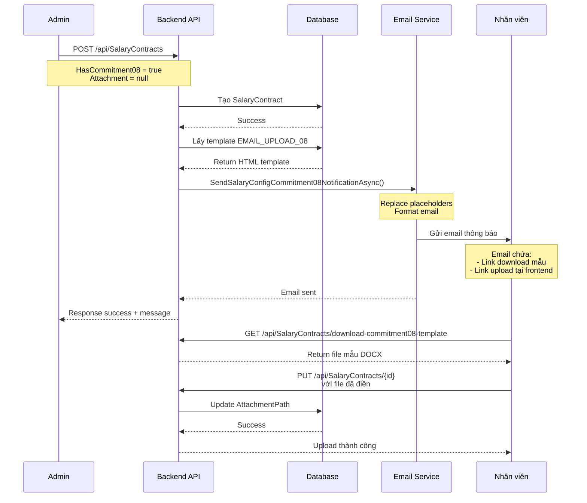

# 📧 Email Thông Báo Upload Cam Kết Thông Tư 08 - Implementation Guide

## ✅ Đã Hoàn Thành

### 1. **Tạo HTML Email Template**
- ✅ Template đã được thêm vào database với code: `EMAIL_UPLOAD_08`
- ✅ Template ID trong database: **14** (theo screenshot)
- 📋 **AvailablePlaceholders:**
  - `{{UserName}}`
  - `{{UserEmail}}`
  - `{{BaseSalary}}`
  - `{{InsuranceSalary}}`
  - `{{ContractType}}`
  - `{{DependentsCount}}`
  - `{{CreatedAt}}`
  - `{{UploadAttachmentLink}}` - Link đến frontend để upload
  - `{{DownloadTemplateLink}}` - Link download file mẫu cam kết
  - `{{UploadDeadline}}` - Deadline upload (7 ngày)
  - `{{HrEmail}}` - Email HR để liên hệ
  - `{{CurrentYear}}` - Năm hiện tại

### 2. **Thêm Method vào EmailService**
- ✅ Interface `IEmailService` đã có method:
  ```csharp
  Task SendSalaryConfigCommitment08NotificationAsync(
      User user, 
      SalaryContracts contract, 
      string uploadLink, 
      string downloadTemplateLink);
  ```

- ✅ Implementation trong `EmailService` class:
  - Lấy template từ database với code `EMAIL_UPLOAD_08`
  - Replace tất cả placeholders
  - Format số tiền theo chuẩn VN (1.000.000)
  - Tính deadline upload = CreatedAt + 7 ngày
  - Gửi email qua SMTP

### 3. **Update SalaryContractsController**
- ✅ Inject `IEmailService` và `IConfiguration`
- ✅ Trong method `CreateContract()`:
  - Kiểm tra `HasCommitment08 = true` và `AttachmentPath = null`
  - Tự động gửi email thông báo
  - Log việc gửi email
  - Thêm message trong response

### 4. **Configuration trong appsettings.json**
Đảm bảo có các config sau:
```json
{
  "Email": {
    "SmtpServer": "smtp.gmail.com",
    "SmtpPort": "587",
    "Username": "your-email@gmail.com",
    "Password": "your-app-password",
    "SenderEmail": "noreply@erpsystem.com",
    "SenderName": "ERP System",
    "HrEmail": "hr@erpsystem.com"
  },
  "FrontendUrl": "http://localhost:3000"
}
```

---

## 🎯 Flow Hoạt Động



---

## 📡 API Endpoints Liên Quan

### 1. **Tạo Salary Contract (Tự động gửi email)**
```http
POST /api/SalaryContracts
Authorization: Bearer {admin_token}
Content-Type: multipart/form-data

FormData:
- UserId: 38
- BaseSalary: 15000000
- InsuranceSalary: 0
- ContractType: FREELANCE
- DependentsCount: 0
- HasCommitment08: true    # ✅ Bật để gửi email
- Attachment: null          # Không upload ngay
```

**Response:**
```json
{
  "message": "Tạo hợp đồng lương thành công. Email hướng dẫn upload cam kết đã được gửi.",
  "data": {
    "id": 123,
    "userId": 38,
    "baseSalary": 15000000,
    "hasCommitment08": true,
    "attachmentPath": null,
    "createdAt": "2024-01-20T10:00:00Z"
  }
}
```

### 2. **Download File Mẫu Cam Kết 08**
```http
GET /api/SalaryContracts/download-commitment08-template
```

**Response:**
- File download: `Mau_Cam_Ket_Thong_Tu_08.docx`
- Content-Type: `application/vnd.openxmlformats-officedocument.wordprocessingml.document`

### 3. **Upload File Cam Kết (Nhân viên)**
```http
PUT /api/SalaryContracts/{contractId}
Authorization: Bearer {user_token}
Content-Type: multipart/form-data

FormData:
- Attachment: [File đã điền và ký]
```

---

## 🌐 Frontend Integration

### **React Component Example**

```tsx
// Page: /circular-08
import { useEffect, useState } from 'react';
import { useAuth } from '@/hooks/useAuth';

const Circular08UploadPage = () => {
  const { user } = useAuth();
  const [contract, setContract] = useState(null);
  const [file, setFile] = useState(null);
  const [uploading, setUploading] = useState(false);

  useEffect(() => {
    // Lấy thông tin contract của user hiện tại
    fetch(`/api/SalaryContracts/user/${user.id}`, {
      headers: { 'Authorization': `Bearer ${getToken()}` }
    })
      .then(res => res.json())
      .then(data => setContract(data.data));
  }, [user.id]);

  const handleDownloadTemplate = async () => {
    const response = await fetch('/api/SalaryContracts/download-commitment08-template');
    const blob = await response.blob();
    const url = window.URL.createObjectURL(blob);
    const a = document.createElement('a');
    a.href = url;
    a.download = 'Mau_Cam_Ket_Thong_Tu_08.docx';
    a.click();
    window.URL.revokeObjectURL(url);
  };

  const handleUpload = async () => {
    if (!file) {
      alert('Vui lòng chọn file');
      return;
    }

    setUploading(true);
    const formData = new FormData();
    formData.append('Attachment', file);

    try {
      const response = await fetch(`/api/SalaryContracts/${contract.id}`, {
        method: 'PUT',
        headers: {
          'Authorization': `Bearer ${getToken()}`
        },
        body: formData
      });

      if (response.ok) {
        alert('Upload thành công!');
        // Reload contract data
        window.location.reload();
      } else {
        alert('Upload thất bại!');
      }
    } catch (error) {
      console.error(error);
      alert('Có lỗi xảy ra!');
    } finally {
      setUploading(false);
    }
  };

  if (!contract) {
    return <div>Đang tải...</div>;
  }

  if (!contract.hasCommitment08) {
    return (
      <div className="alert alert-info">
        ✅ Bạn không cần điền Cam kết Thông tư 08
      </div>
    );
  }

  if (contract.attachmentPath) {
    return (
      <div className="alert alert-success">
        ✅ Bạn đã upload file cam kết thành công!
        <br />
        <a href={`${API_URL}${contract.attachmentPath}`} target="_blank">
          📎 Xem file đã upload: {contract.attachmentFileName}
        </a>
      </div>
    );
  }

  return (
    <div className="container">
      <h2>📤 Upload Cam Kết Thông Tư 08</h2>
      
      <div className="alert alert-warning">
        <h4>⚠️ Yêu cầu quan trọng</h4>
        <p>Vì lương của bạn <strong>{contract.baseSalary.toLocaleString()} VNĐ/tháng</strong>, 
           bạn cần điền và upload Cam kết Thông tư 08.</p>
        <p>⏰ Hạn cuối: <strong>{new Date(contract.createdAt).toLocaleDateString('vi-VN', { 
          day: '2-digit', 
          month: '2-digit', 
          year: 'numeric' 
        })}</strong></p>
      </div>

      <div className="step-box">
        <h4>📝 Các bước thực hiện:</h4>
        <ol>
          <li>
            <strong>Tải file mẫu:</strong>
            <button onClick={handleDownloadTemplate} className="btn btn-secondary">
              📥 Tải mẫu Cam kết 08 (.docx)
            </button>
          </li>
          <li><strong>Điền thông tin:</strong> Mở file bằng Word và điền đầy đủ thông tin</li>
          <li><strong>Ký tên:</strong> Ký tên và đóng dấu (nếu có)</li>
          <li>
            <strong>Upload:</strong> Chọn file đã hoàn thành và upload
            <input 
              type="file" 
              accept=".pdf,.doc,.docx"
              onChange={(e) => setFile(e.target.files[0])}
              className="form-control mt-2"
            />
          </li>
        </ol>
      </div>

      <div className="text-center mt-4">
        <button 
          onClick={handleUpload} 
          disabled={!file || uploading}
          className="btn btn-primary btn-lg"
        >
          {uploading ? '⏳ Đang upload...' : '📤 Upload file'}
        </button>
      </div>

      <div className="alert alert-info mt-4">
        <h5>💡 Lưu ý:</h5>
        <ul>
          <li>File chấp nhận: <strong>PDF, DOC, DOCX</strong></li>
          <li>Kích thước tối đa: <strong>5MB</strong></li>
          <li>Đảm bảo file rõ ràng, có chữ ký hợp lệ</li>
          <li>Bạn có thể cập nhật file nhiều lần nếu cần</li>
        </ul>
      </div>
    </div>
  );
};

export default Circular08UploadPage;
```

---

## 📧 Email Template Preview

Email được gửi sẽ có dạng:

```
Subject: [ERP] Cấu hình lương thành công - Vui lòng upload Cam kết Thông tư 08

From: ERP System <noreply@erpsystem.com>
To: nhanvien@company.com

--------------------------------------------------

💼 Cấu hình Lương Thành Công
Vui lòng upload Cam kết Thông tư 08

Kính gửi Nguyễn Văn A,

Chúc mừng! Hồ sơ lương của bạn đã được cấu hình thành công trên hệ thống ERP.

📋 Thông tin cấu hình lương
Email: nhanvien@company.com
Lương cơ bản: 15,000,000 VNĐ
Lương đóng bảo hiểm: 5,682,000 VNĐ
Loại hợp đồng: Vãng lai
Số người phụ thuộc: 0 người
Ngày cấu hình: 20/01/2024 10:00:00

⚠️ YÊU CẦU QUAN TRỌNG
Vì bạn đã chọn "Có Cam kết Thông tư 08", bạn cần hoàn thành các bước sau:

📝 Các bước thực hiện:
1. Tải file mẫu: [📥 Tải mẫu Cam kết 08]
2. Điền thông tin: Hoàn thiện các thông tin cá nhân trong file
3. Ký tên: Ký tên và đóng dấu (nếu có)
4. Upload: Click nút bên dưới để upload file đã hoàn thành

⏰ Hạn cuối: 27/01/2024

[📤 Upload Cam kết Thông tư 08 ngay]

💡 Lưu ý:
- File chấp nhận: PDF
- Kích thước tối đa: 5MB
- Đảm bảo file rõ ràng, có chữ ký hợp lệ
- Bạn có thể cập nhật file nhiều lần nếu cần

Trân trọng,
Phòng Nhân sự - ERP System

--------------------------------------------------
📧 Email này được gửi tự động từ ERP System
Liên hệ: hr@erpsystem.com
© 2024 ERP System - Hệ thống quản lý doanh nghiệp
```

---

## 🧪 Testing Guide

### **Test 1: Tạo contract với HasCommitment08 = true**

```bash
curl -X POST "http://localhost:5000/api/SalaryContracts" \
  -H "Authorization: Bearer {admin_token}" \
  -H "Content-Type: multipart/form-data" \
  -F "UserId=38" \
  -F "BaseSalary=15000000" \
  -F "InsuranceSalary=0" \
  -F "ContractType=FREELANCE" \
  -F "DependentsCount=0" \
  -F "HasCommitment08=true"
```

**Expected:**
- ✅ Contract được tạo thành công
- ✅ Email được gửi đến user.Email
- ✅ Log: "Sent commitment notification email to user 38 for contract {id}"
- ✅ Response message: "...Email hướng dẫn upload cam kết đã được gửi."

### **Test 2: Download file mẫu**

```bash
curl -X GET "http://localhost:5000/api/SalaryContracts/download-commitment08-template" \
  --output "test.docx"
```

**Expected:**
- ✅ File `test.docx` được download
- ✅ Mở được bằng Microsoft Word
- ✅ Content-Type: `application/vnd.openxmlformats-officedocument.wordprocessingml.document`

### **Test 3: Upload file cam kết**

```bash
curl -X PUT "http://localhost:5000/api/SalaryContracts/123" \
  -H "Authorization: Bearer {user_token}" \
  -H "Content-Type: multipart/form-data" \
  -F "Attachment=@path/to/filled_commitment.pdf"
```

**Expected:**
- ✅ File được upload thành công
- ✅ `AttachmentPath` và `AttachmentFileName` được update
- ✅ File cũ (nếu có) bị xóa
- ✅ Response message: "Cập nhật hợp đồng lương thành công"

---

## ⚙️ Configuration

### **Thay đổi deadline upload (mặc định 7 ngày)**

Trong `EmailService.cs`, dòng:
```csharp
var uploadDeadline = contract.CreatedAt.AddDays(7).ToString("dd/MM/yyyy");
```

Đổi `AddDays(7)` thành số ngày mong muốn.

### **Thay đổi file extensions cho phép**

Trong `SalaryContractsController.cs`:
```csharp
private readonly string[] _allowedExtensions = { ".pdf", ".doc", ".docx", ".jpg", ".jpeg", ".png" };
```

### **Thay đổi email HR**

Trong `appsettings.json`:
```json
{
  "Email": {
    "HrEmail": "hr@yourcompany.com"
  }
}
```

---

## 🔒 Security & Best Practices

1. **Email Validation:**
   - ✅ Kiểm tra email config trước khi gửi
   - ✅ Log lỗi SMTP chi tiết
   - ✅ Không throw exception nếu email fail

2. **File Upload Security:**
   - ✅ Validate file extension
   - ✅ Validate file size (max 5MB)
   - ✅ Generate GUID filename để tránh path traversal
   - ✅ Lưu file trong thư mục riêng cho từng user

3. **Authorization:**
   - ✅ Admin tạo contract
   - ✅ User chỉ upload file cho contract của mình
   - ✅ JWT authentication required

4. **Data Privacy:**
   - ✅ Email chỉ gửi đến user.Email
   - ✅ Không expose sensitive data trong logs
   - ✅ File attachment chỉ user/admin xem được

---

## 📊 Database Changes

### Template đã thêm vào bảng `document_templates`:

| Column | Value |
|--------|-------|
| Id | 14 |
| Name | Email thông báo cập nhật TT08 |
| TemplateType | email |
| Code | EMAIL_UPLOAD_08 |
| HtmlContent | [HTML template với placeholders] |
| Description | *empty* |
| AvailablePlaceholders | *JSON array* |
| Version | 1 |
| IsActive | true |
| IsDefault | false |
| CreatedAt | 2024-01-20... |

---

## ✅ Checklist Hoàn Thành

- [x] Tạo HTML email template
- [x] Thêm template vào database với code `EMAIL_UPLOAD_08`
- [x] Thêm method `SendSalaryConfigCommitment08NotificationAsync` vào IEmailService
- [x] Implement method trong EmailService
- [x] Inject IEmailService và IConfiguration vào SalaryContractsController
- [x] Update CreateContract để gửi email tự động
- [x] Link download template = `/api/SalaryContracts/download-commitment08-template`
- [x] Link upload = `{FrontendUrl}/circular-08`
- [x] Build successful
- [x] Tạo documentation

---

## 🚀 Next Steps

1. **Testing:**
   - Test email gửi thành công
   - Test download template
   - Test upload file cam kết
   - Test với nhiều users khác nhau

2. **Frontend:**
   - Implement page `/circular-08`
   - Handle file upload
   - Display upload status
   - Show deadline warning

3. **Optional Enhancements:**
   - Gửi email reminder trước deadline 1-2 ngày
   - Admin dashboard: danh sách users chưa upload
   - Preview PDF file trước khi upload
   - Validate file content (OCR kiểm tra chữ ký?)

---

## 📞 Support

Nếu có vấn đề:
1. Kiểm tra logs trong `_logger`
2. Verify email configuration trong `appsettings.json`
3. Kiểm tra template có tồn tại trong database (code = `EMAIL_UPLOAD_08`)
4. Test SMTP connection riêng

---

**✨ Implementation hoàn tất! Sẵn sàng để test và deploy!**
