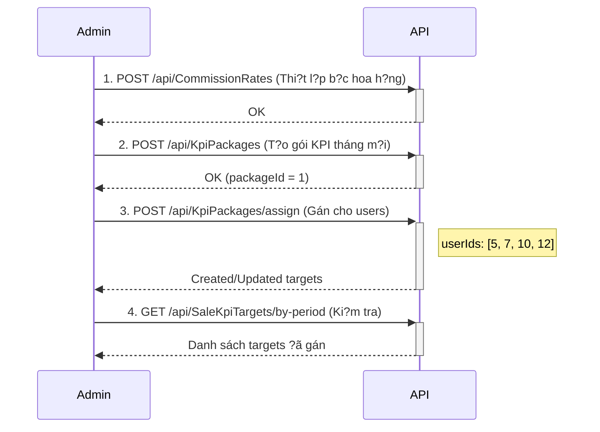
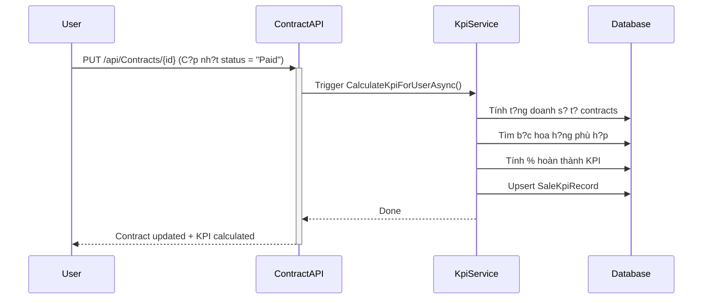
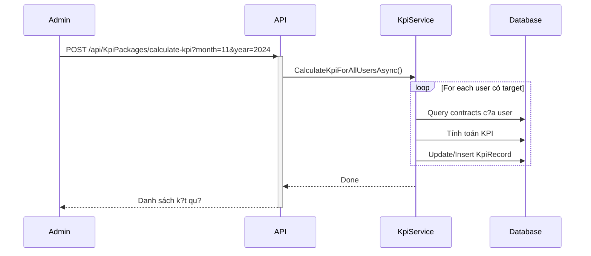
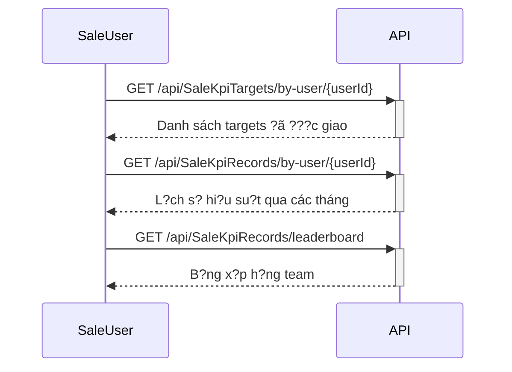

# ?? KPI MODULE - API DOCUMENTATION FOR FRONTEND

## ?? T?NG QUAN H? TH?NG

Module KPI qu?n lý vi?c thi?t l?p ch? tiêu, tính toán hi?u su?t và hoa h?ng cho ??i ng? Sale.

### Các thành ph?n chính:
1. **KpiPackages** - Gói KPI template (có th? gán cho nhi?u nhân viên)
2. **SaleKpiTargets** - M?c tiêu KPI c? th? ???c gán cho t?ng nhân viên
3. **CommissionRates** - B?c thang hoa h?ng theo doanh s?
4. **SaleKpiRecords** - B?n ghi k?t qu? KPI th?c t? (t? ??ng tính toán)

---

## ?? AUTHENTICATION

T?t c? các API ??u yêu c?u **Bearer Token** trong header:

```
Authorization: Bearer {your_jwt_token}
```

### Phân quy?n:
- **Admin**: Toàn quy?n qu?n lý t?t c? module
- **Manager**: Xem báo cáo và th?ng kê
- **Sale User**: Ch? xem KPI c?a chính mình

---

## ?? 1. KPI PACKAGES API

> **Base URL**: `/api/KpiPackages`
> 
> **Yêu c?u quy?n**: Admin

### 1.1. L?y danh sách gói KPI

```http
GET /api/KpiPackages?month={month}&year={year}&isActive={true/false}
```

**Query Parameters:**
- `month` (optional): L?c theo tháng (1-12)
- `year` (optional): L?c theo n?m
- `isActive` (optional): L?c theo tr?ng thái ho?t ??ng

**Response:**
```json
{
  "success": true,
  "data": [
    {
      "id": 1,
      "name": "KPI Sale Tháng 11/2024",
      "month": 11,
      "year": 2024,
      "targetAmount": 50000000,
      "description": "KPI mùa cao ?i?m cu?i n?m",
      "isActive": true,
      "createdByUserId": 1,
      "createdByUserName": "Admin",
      "createdAt": "2024-11-01T00:00:00Z",
      "assignedUsersCount": 5
    }
  ]
}
```

---

### 1.2. L?y chi ti?t m?t gói KPI

```http
GET /api/KpiPackages/{id}
```

**Response:**
```json
{
  "success": true,
  "data": {
    "id": 1,
    "name": "KPI Sale Tháng 11/2024",
    "month": 11,
    "year": 2024,
    "targetAmount": 50000000,
    "description": "KPI mùa cao ?i?m cu?i n?m",
    "isActive": true,
    "createdByUserId": 1,
    "createdByUserName": "Admin",
    "createdAt": "2024-11-01T00:00:00Z",
    "assignedUsersCount": 5
  }
}
```

---

### 1.3. T?o gói KPI m?i

```http
POST /api/KpiPackages
Content-Type: application/json
```

**Request Body:**
```json
{
  "name": "KPI Sale Tháng 12/2024",
  "month": 12,
  "year": 2024,
  "targetAmount": 60000000,
  "description": "KPI cu?i n?m, t?ng target 20%"
}
```

**Response:**
```json
{
  "success": true,
  "message": "T?o gói KPI thành công",
  "data": {
    "id": 2,
    "name": "KPI Sale Tháng 12/2024",
    "month": 12,
    "year": 2024,
    "targetAmount": 60000000,
    "description": "KPI cu?i n?m, t?ng target 20%",
    "isActive": true,
    "createdByUserId": 1,
    "createdAt": "2024-11-28T00:00:00Z"
  }
}
```

---

### 1.4. C?p nh?t gói KPI

```http
PUT /api/KpiPackages/{id}
Content-Type: application/json
```

**Request Body:**
```json
{
  "name": "KPI Sale Tháng 12/2024 (?i?u ch?nh)",
  "month": 12,
  "year": 2024,
  "targetAmount": 65000000,
  "description": "T?ng thêm 5tr do nhu c?u th? tr??ng",
  "isActive": true
}
```

**Response:**
```json
{
  "success": true,
  "message": "C?p nh?t gói KPI thành công",
  "data": { ... }
}
```

**?? L?u ý:** Vi?c c?p nh?t gói KPI **KHÔNG** t? ??ng c?p nh?t l?i TargetAmount c?a nhân viên ?ã ???c gán. ?ây là c? ch? **Snapshot** ?? gi? l?i giá tr? l?ch s?. N?u mu?n thay ??i target c?a nhân viên, c?n gán l?i thông qua API `assign`.

---

### 1.5. Xóa gói KPI

```http
DELETE /api/KpiPackages/{id}
```

**Response:**
```json
{
  "success": true,
  "message": "?ã xóa gói KPI v?nh vi?n"
}
```

ho?c n?u gói ?ã ???c s? d?ng:

```json
{
  "success": true,
  "message": "Gói ?ã ???c s? d?ng nên ch? chuy?n sang tr?ng thái ng?ng ho?t ??ng"
}
```

---

### 1.6. ?? Gán gói KPI cho nhân viên (QUAN TR?NG)

```http
POST /api/KpiPackages/assign
Content-Type: application/json
```

**Request Body:**
```json
{
  "kpiPackageId": 1,
  "userIds": [5, 7, 10, 12],
  "notes": "Giao KPI tháng 12 cho team Sale A"
}
```

**Response:**
```json
{
  "success": true,
  "message": "Hoàn t?t quy trình gán KPI",
  "summary": {
    "total": 4,
    "created": 2,
    "updated": 2,
    "failed": 0
  },
  "details": [
    {
      "userId": 5,
      "userName": "Nguy?n V?n A",
      "status": "Created",
      "message": "?ã gán gói KPI 'KPI Sale Tháng 12/2024' thành công"
    },
    {
      "userId": 7,
      "userName": "Tr?n Th? B",
      "status": "Updated",
      "message": "?ã c?p nh?t KPI sang gói 'KPI Sale Tháng 12/2024'"
    }
  ]
}
```

**Logic:**
- N?u user **ch?a có** KPI tháng ?ó ? T?o m?i (`Created`)
- N?u user **?ã có** KPI tháng ?ó ? C?p nh?t l?i theo gói m?i (`Updated`)
- TargetAmount ???c **snapshot** (l?u giá tr? t?i th?i ?i?m gán)

---

### 1.7. L?y danh sách users ?ã ???c gán gói

```http
GET /api/KpiPackages/{id}/assigned-users
```

**Response:**
```json
{
  "success": true,
  "data": [
    {
      "id": 101,
      "userId": 5,
      "userName": "Nguy?n V?n A",
      "userEmail": "a@example.com",
      "targetAmount": 50000000,
      "assignedAt": "2024-11-15T08:00:00Z",
      "isActive": true,
      "notes": "Giao KPI tháng 12 cho team Sale A"
    }
  ]
}
```

---

### 1.8. ?? Tính toán KPI cho t?t c? users

```http
POST /api/KpiPackages/calculate-kpi?month={month}&year={year}
```

**Query Parameters:**
- `month` (optional): M?c ??nh là tháng hi?n t?i
- `year` (optional): M?c ??nh là n?m hi?n t?i

**Response:**
```json
{
  "success": true,
  "message": "?ã tính toán KPI Record cho 5 users",
  "month": 11,
  "year": 2024,
  "data": [
    {
      "userId": 5,
      "userName": "Nguy?n V?n A",
      "targetAmount": 50000000,
      "totalPaidAmount": 65000000,
      "achievementPercentage": 130.00,
      "isKpiAchieved": true,
      "commissionAmount": 5200000,
      "commissionPercentage": 8.00,
      "tierLevel": 3,
      "totalContracts": 12
    }
  ]
}
```

**Khi nào g?i API này:**
- Admin mu?n tính l?i KPI th? công
- Cu?i tháng ?? ra báo cáo
- Sau khi có thay ??i l?n trong h?p ??ng

---

### 1.9. ?? Tính toán KPI cho m?t user c? th?

```http
POST /api/KpiPackages/calculate-kpi-user/{userId}?month={month}&year={year}
```

**Response:**
```json
{
  "success": true,
  "message": "?ã tính toán KPI thành công",
  "data": {
    "id": 15,
    "userId": 5,
    "userName": "Nguy?n V?n A",
    "month": 11,
    "year": 2024,
    "targetAmount": 50000000,
    "totalPaidAmount": 65000000,
    "achievementPercentage": 130.00,
    "isKpiAchieved": true,
    "commissionAmount": 5200000,
    "commissionPercentage": 8.00,
    "tierLevel": 3,
    "totalContracts": 12,
    "updatedAt": "2024-11-28T10:30:00Z"
  }
}
```

---

## ?? 2. SALE KPI TARGETS API

> **Base URL**: `/api/SaleKpiTargets`
> 
> **Mô t?**: Qu?n lý m?c tiêu KPI ???c gán cho t?ng nhân viên c? th?

### 2.1. L?y danh sách KPI Targets

```http
GET /api/SaleKpiTargets
```

**Response:**
```json
[
  {
    "id": 101,
    "userId": 5,
    "saleUserName": "Nguy?n V?n A",
    "saleUserEmail": "a@example.com",
    "month": 11,
    "year": 2024,
    "targetAmount": 50000000,
    "assignedByUserId": 1,
    "assignedByUserName": "Admin",
    "assignedAt": "2024-11-01T00:00:00Z",
    "notes": "KPI cao ?i?m cu?i n?m",
    "isActive": true,
    "createdAt": "2024-11-01T00:00:00Z"
  }
]
```

---

### 2.2. L?y chi ti?t KPI Target theo ID

```http
GET /api/SaleKpiTargets/{id}
```

**Response:**
```json
{
  "id": 101,
  "userId": 5,
  "saleUser": {
    "id": 5,
    "name": "Nguy?n V?n A",
    "email": "a@example.com",
    "phoneNumber": "0901234567",
    "departmentId": 2,
    "departmentName": "Phòng Kinh Doanh",
    "positionId": 3,
    "positionName": "Sale Executive"
  },
  "month": 11,
  "year": 2024,
  "targetAmount": 50000000,
  "assignedByUserId": 1,
  "assignedByUser": {
    "id": 1,
    "name": "Admin",
    "email": "admin@example.com",
    "phoneNumber": "0987654321"
  },
  "assignedAt": "2024-11-01T00:00:00Z",
  "notes": "KPI cao ?i?m cu?i n?m",
  "isActive": true,
  "createdAt": "2024-11-01T00:00:00Z",
  "updatedAt": null
}
```

---

### 2.3. L?y KPI Target theo userId, month, year

```http
GET /api/SaleKpiTargets/by-user-period?userId={userId}&month={month}&year={year}
```

**Use case:** Hi?n th? KPI c?a user trong tháng c? th?

**Response:** Gi?ng nh? API 2.2

---

### 2.4. L?y t?t c? KPI Targets c?a m?t user

```http
GET /api/SaleKpiTargets/by-user/{userId}
```

**Use case:** Xem l?ch s? KPI c?a m?t nhân viên qua các tháng

---

### 2.5. L?y KPI Targets theo tháng/n?m

```http
GET /api/SaleKpiTargets/by-period?month={month}&year={year}
```

**Use case:** Xem toàn b? KPI ?ã giao trong tháng

---

### 2.6. T?o KPI Target th? công (không qua gói)

```http
POST /api/SaleKpiTargets
Content-Type: application/json
```

**Request Body:**
```json
{
  "userId": 5,
  "month": 12,
  "year": 2024,
  "targetAmount": 55000000,
  "assignedByUserId": 1,
  "notes": "Target ??c bi?t cho nhân viên xu?t s?c",
  "isActive": true
}
```

**Response:**
```json
{
  "id": 105,
  "userId": 5,
  // ... chi ti?t nh? API 2.2
}
```

**?? L?u ý:** Th??ng thì nên dùng API `assign` c?a KpiPackages thay vì t?o th? công

---

### 2.7. C?p nh?t KPI Target

```http
PUT /api/SaleKpiTargets/{id}
Content-Type: application/json
```

**Request Body:**
```json
{
  "id": 101,
  "userId": 5,
  "month": 11,
  "year": 2024,
  "targetAmount": 52000000,
  "assignedByUserId": 1,
  "notes": "T?ng target thêm 2 tri?u",
  "isActive": true
}
```

---

### 2.8. Xóa KPI Target (soft delete)

```http
DELETE /api/SaleKpiTargets/{id}
```

**Response:**
```
204 No Content
```

---

## ?? 3. COMMISSION RATES API

> **Base URL**: `/api/CommissionRates`
> 
> **Mô t?**: Qu?n lý b?c thang hoa h?ng theo doanh s?

### 3.1. L?y danh sách b?c hoa h?ng

```http
GET /api/CommissionRates
```

**Response:**
```json
[
  {
    "id": 1,
    "minAmount": 0,
    "maxAmount": 30000000,
    "commissionPercentage": 5.00,
    "tierLevel": 1,
    "isActive": true,
    "description": "B?c 1: D??i 30 tri?u",
    "createdAt": "2024-01-01T00:00:00Z",
    "updatedAt": null
  },
  {
    "id": 2,
    "minAmount": 30000000,
    "maxAmount": 60000000,
    "commissionPercentage": 7.00,
    "tierLevel": 2,
    "isActive": true,
    "description": "B?c 2: T? 30-60 tri?u",
    "createdAt": "2024-01-01T00:00:00Z",
    "updatedAt": null
  },
  {
    "id": 3,
    "minAmount": 60000000,
    "maxAmount": 100000000,
    "commissionPercentage": 8.00,
    "tierLevel": 3,
    "isActive": true,
    "description": "B?c 3: T? 60-100 tri?u",
    "createdAt": "2024-01-01T00:00:00Z",
    "updatedAt": null
  },
  {
    "id": 4,
    "minAmount": 100000000,
    "maxAmount": null,
    "commissionPercentage": 10.00,
    "tierLevel": 4,
    "isActive": true,
    "description": "B?c 4: Trên 100 tri?u",
    "createdAt": "2024-01-01T00:00:00Z",
    "updatedAt": null
  }
]
```

**Gi?i thích c?u trúc:**
- `minAmount`: Doanh s? t?i thi?u (VN?)
- `maxAmount`: Doanh s? t?i ?a (null = không gi?i h?n)
- `commissionPercentage`: T? l? % hoa h?ng
- `tierLevel`: B?c (dùng ?? s?p x?p và hi?n th?)

---

### 3.2. L?y chi ti?t m?t b?c hoa h?ng

```http
GET /api/CommissionRates/{id}
```

---

### 3.3. T?o b?c hoa h?ng m?i

```http
POST /api/CommissionRates
Content-Type: application/json
```

**Request Body:**
```json
{
  "minAmount": 150000000,
  "maxAmount": null,
  "commissionPercentage": 12.00,
  "tierLevel": 5,
  "isActive": true,
  "description": "B?c VIP: Trên 150 tri?u"
}
```

**Validation:**
- `minAmount` >= 0
- `maxAmount` > `minAmount` (n?u có)
- `commissionPercentage` trong kho?ng 0-100
- Không ???c trùng l?p kho?ng ti?n v?i b?c khác

---

### 3.4. C?p nh?t b?c hoa h?ng

```http
PUT /api/CommissionRates/{id}
Content-Type: application/json
```

**Request Body:** Gi?ng nh? t?o m?i

---

### 3.5. Xóa b?c hoa h?ng (soft delete)

```http
DELETE /api/CommissionRates/{id}
```

---

## ?? 4. SALE KPI RECORDS API

> **Base URL**: `/api/SaleKpiRecords`
> 
> **Mô t?**: Xem k?t qu? KPI th?c t? (t? ??ng tính toán t? h?p ??ng)

### 4.1. L?y danh sách KPI Records (có filter)

```http
GET /api/SaleKpiRecords?month={month}&year={year}&userId={userId}&isKpiAchieved={true/false}
```

**Query Parameters (t?t c? optional):**
- `month`: L?c theo tháng
- `year`: L?c theo n?m
- `userId`: L?c theo user
- `isKpiAchieved`: L?c theo tr?ng thái hoàn thành KPI

**Response:**
```json
{
  "success": true,
  "data": [
    {
      "id": 15,
      "userId": 5,
      "userName": "Nguy?n V?n A",
      "userEmail": "a@example.com",
      "month": 11,
      "year": 2024,
      "targetAmount": 50000000,
      "totalPaidAmount": 65000000,
      "achievementPercentage": 130.00,
      "isKpiAchieved": true,
      "commissionPercentage": 8.00,
      "commissionAmount": 5200000,
      "commissionTierLevel": 3,
      "totalContracts": 12,
      "notes": null,
      "createdAt": "2024-11-01T00:00:00Z",
      "updatedAt": "2024-11-28T10:30:00Z"
    }
  ]
}
```

**Gi?i thích các tr??ng:**
- `targetAmount`: Ch? tiêu ???c giao
- `totalPaidAmount`: T?ng doanh s? th?c t? (t? contracts có status Paid/Completed/Signed/Active)
- `achievementPercentage`: % hoàn thành = (totalPaidAmount / targetAmount) * 100
- `isKpiAchieved`: true n?u ??t/v??t target
- `commissionPercentage`: % hoa h?ng ???c h??ng
- `commissionAmount`: S? ti?n hoa h?ng = totalPaidAmount * commissionPercentage / 100
- `commissionTierLevel`: B?c hoa h?ng ?ang áp d?ng
- `totalContracts`: S? l??ng h?p ??ng ?ã ký

---

### 4.2. L?y chi ti?t m?t KPI Record

```http
GET /api/SaleKpiRecords/{id}
```

**Response:**
```json
{
  "success": true,
  "data": {
    "id": 15,
    "userId": 5,
    "saleUser": {
      "id": 5,
      "name": "Nguy?n V?n A",
      "email": "a@example.com",
      "phoneNumber": "0901234567",
      "departmentName": "Phòng Kinh Doanh",
      "positionName": "Sale Executive"
    },
    "month": 11,
    "year": 2024,
    "kpiTargetId": 101,
    "kpiPackageName": "KPI Sale Tháng 11/2024",
    "targetAmount": 50000000,
    "totalPaidAmount": 65000000,
    "achievementPercentage": 130.00,
    "isKpiAchieved": true,
    "commissionPercentage": 8.00,
    "commissionAmount": 5200000,
    "commissionTierLevel": 3,
    "totalContracts": 12,
    "notes": null,
    "approvedBy": null,
    "approvedByUserName": null,
    "approvedAt": null,
    "createdAt": "2024-11-01T00:00:00Z",
    "updatedAt": "2024-11-28T10:30:00Z"
  }
}
```

---

### 4.3. L?y KPI Records c?a m?t user

```http
GET /api/SaleKpiRecords/by-user/{userId}
```

**Use case:** Xem l?ch s? hi?u su?t c?a m?t nhân viên

---

### 4.4. L?y KPI Records theo tháng/n?m

```http
GET /api/SaleKpiRecords/by-period?month={month}&year={year}
```

**Use case:** Xem t?ng quan hi?u su?t team trong tháng

---

### 4.5. ?? L?y b?ng x?p h?ng (Leaderboard)

```http
GET /api/SaleKpiRecords/leaderboard?month={month}&year={year}
```

**Response:**
```json
{
  "success": true,
  "month": 11,
  "year": 2024,
  "data": [
    {
      "rank": 1,
      "userId": 5,
      "userName": "Nguy?n V?n A",
      "targetAmount": 50000000,
      "totalPaidAmount": 85000000,
      "achievementPercentage": 170.00,
      "isKpiAchieved": true,
      "commissionAmount": 8500000,
      "totalContracts": 15
    },
    {
      "rank": 2,
      "userId": 7,
      "userName": "Tr?n Th? B",
      "targetAmount": 50000000,
      "totalPaidAmount": 72000000,
      "achievementPercentage": 144.00,
      "isKpiAchieved": true,
      "commissionAmount": 5760000,
      "totalContracts": 11
    }
  ]
}
```

**Use case:** Hi?n th? b?ng x?p h?ng sale xu?t s?c trong tháng

---

### 4.6. ?? L?y th?ng kê t?ng quan (Admin only)

```http
GET /api/SaleKpiRecords/statistics?month={month}&year={year}
```

**Response:**
```json
{
  "success": true,
  "data": {
    "month": 11,
    "year": 2024,
    "totalUsers": 10,
    "usersAchievedKpi": 7,
    "usersNotAchievedKpi": 3,
    "achievementRate": 70.00,
    "totalTargetAmount": 500000000,
    "totalPaidAmount": 580000000,
    "totalCommissionAmount": 46400000,
    "totalContracts": 95,
    "averageAchievementPercentage": 116.00
  }
}
```

**Use case:** Dashboard t?ng quan cho admin

---

### 4.7. C?p nh?t ghi chú KPI Record (Admin only)

```http
PUT /api/SaleKpiRecords/{id}/notes
Content-Type: application/json
```

**Request Body:**
```json
{
  "notes": "?ã duy?t thanh toán hoa h?ng tháng 11"
}
```

**Response:**
```json
{
  "success": true,
  "message": "?ã c?p nh?t ghi chú"
}
```

---

## ?? QUY TRÌNH HO?T ??NG

### A. QUY TRÌNH THI?T L?P KPI (Admin)



---

### B. QUY TRÌNH T? ??NG TÍNH KPI



**Trigger t? ??ng khi:**
- Contract chuy?n sang status: `Paid`, `Completed`, `Signed`, `Active`
- H? th?ng t? ??ng g?i `KpiCalculationService.CalculateKpiForUserAsync()`

---

### C. QUY TRÌNH TÍNH TOÁN TH? CÔNG



**Khi nào dùng:**
- Cu?i tháng mu?n t?ng h?p
- Ki?m tra l?i sau khi có ch?nh s?a contracts
- Báo cáo ??nh k?

---

### D. QUY TRÌNH XEM KPI (Sale User)



---

## ?? G?I Ý UI/UX CHO FRONTEND

### 1. Dashboard Admin - Module KPI Management

```
???????????????????????????????????????????????????????????????
?  KPI MANAGEMENT DASHBOARD                                    ?
???????????????????????????????????????????????????????????????
?  ?? Th?ng kê tháng 11/2024                                  ?
?  ????????????????????????????????????????????????????????????
?  ? T?ng Users   ? ??t KPI      ? Ch?a ??t     ? T? l? ??t  ??
?  ?     10       ?      7       ?      3       ?   70%      ??
?  ????????????????????????????????????????????????????????????
?                                                              ?
?  ?? Doanh s? & Hoa h?ng                                     ?
?  ???????????????????????????????????????????????????????????
?  ? Target       ? Th?c t?      ? T?ng hoa h?ng            ??
?  ? 500tr        ? 580tr        ? 46.4tr                   ??
?  ???????????????????????????????????????????????????????????
?                                                              ?
?  [T?o gói KPI m?i] [Gán KPI cho users] [Tính KPI]          ?
?                                                              ?
?  ?? Danh sách gói KPI                                       ?
?  ????????????????????????????????????????????????????????????
?  ? Gói KPI Sale 11/2024  ? 50tr  ? 5 users ? [Edit] [View] ?
?  ? Gói KPI Sale 12/2024  ? 60tr  ? 0 users ? [Edit] [View] ?
?  ????????????????????????????????????????????????????????????
???????????????????????????????????????????????????????????????
```

**API c?n g?i:**
- `GET /api/SaleKpiRecords/statistics` ? Th?ng kê
- `GET /api/KpiPackages` ? Danh sách gói KPI

---

### 2. Form Gán KPI cho Users

```
???????????????????????????????????????????????????????????????
?  GÁN GÓI KPI CHO NHÂN VIÊN                                  ?
???????????????????????????????????????????????????????????????
?  Ch?n gói KPI: [Dropdown: Gói KPI Sale 12/2024 - 60tr    ?]?
?                                                              ?
?  Ch?n nhân viên:                                            ?
?  ?????????????????????????????????????????????????????????? ?
?  ? ? Nguy?n V?n A (Sale Executive)                        ? ?
?  ? ? Tr?n Th? B (Senior Sale)                             ? ?
?  ? ? Lê V?n C (Junior Sale)                               ? ?
?  ? ? Ph?m Th? D (Sale Executive)                          ? ?
?  ?????????????????????????????????????????????????????????? ?
?                                                              ?
?  Ghi chú: [Giao KPI tháng 12 cho team A________________]   ?
?                                                              ?
?  [H?y]                              [Gán KPI cho 3 users]   ?
???????????????????????????????????????????????????????????????
```

**API c?n g?i:**
- `GET /api/KpiPackages?isActive=true` ? Load gói KPI
- `GET /api/Users?role=Sale` ? Load danh sách Sale
- `POST /api/KpiPackages/assign` ? Submit

---

### 3. Dashboard User - My KPI Performance

```
???????????????????????????????????????????????????????????????
?  HI?U SU?T C?A TÔI - THÁNG 11/2024                          ?
???????????????????????????????????????????????????????????????
?  ?? KPI Target: 50,000,000 VN?                             ?
?  ?? Th?c t?: 65,000,000 VN?                                ?
?                                                              ?
?  ???????????????????????  130% (V??t target 15tr)           ?
?                                                              ?
?  ? Tr?ng thái: ??T KPI                                    ?
?  ?? Hoa h?ng d? ki?n: 5,200,000 VN? (8%)                   ?
?  ?? S? h?p ??ng: 12 contracts                              ?
?  ?? C?p nh?t l?n cu?i: 28/11/2024 10:30                    ?
?                                                              ?
?  ?????????????????????????????????????????????????????????? ?
?  ? L?CH S? HI?U SU?T                                      ? ?
?  ????????????????????????????????????????????????????????? ?
?  ? Tháng  ? Target   ? Th?c t?  ? % KPI? Hoa h?ng       ? ?
?  ????????????????????????????????????????????????????????? ?
?  ? 11/2024? 50tr     ? 65tr     ? 130% ? 5.2tr ?       ? ?
?  ? 10/2024? 45tr     ? 42tr     ?  93% ? 2.1tr ?       ? ?
?  ? 09/2024? 50tr     ? 58tr     ? 116% ? 4.6tr ?       ? ?
?  ????????????????????????????????????????????????????????? ?
?                                                              ?
?  [Xem b?ng x?p h?ng]                                        ?
???????????????????????????????????????????????????????????????
```

**API c?n g?i:**
- `GET /api/SaleKpiRecords/by-user/{userId}?month=11&year=2024` ? KPI hi?n t?i
- `GET /api/SaleKpiRecords/by-user/{userId}` ? L?ch s?

---

### 4. Leaderboard - B?ng x?p h?ng

```
???????????????????????????????????????????????????????????????
?  ?? B?NG X?P H?NG THÁNG 11/2024                             ?
???????????????????????????????????????????????????????????????
?  ?? #1  Nguy?n V?n A    ? 170%  ? 85tr/50tr  ? 8.5tr hoa h?ng?
?  ?? #2  Tr?n Th? B      ? 144%  ? 72tr/50tr  ? 5.7tr hoa h?ng?
?  ?? #3  Ph?m Th? D      ? 132%  ? 66tr/50tr  ? 5.2tr hoa h?ng?
?     #4  Lê V?n C        ? 108%  ? 54tr/50tr  ? 4.3tr hoa h?ng?
?     #5  Hoàng V?n E     ?  96%  ? 48tr/50tr  ? 2.4tr hoa h?ng?
???????????????????????????????????????????????????????????????
```

**API c?n g?i:**
- `GET /api/SaleKpiRecords/leaderboard?month=11&year=2024`

---

### 5. Commission Rates Management

```
???????????????????????????????????????????????????????????????
?  CÀI ??T B?C HOA H?NG                                       ?
???????????????????????????????????????????????????????????????
?  [Thêm b?c m?i]                                             ?
?                                                              ?
?  B?c 1: 0 - 30tr      ? 5%  hoa h?ng  [Edit] [Delete]      ?
?  B?c 2: 30tr - 60tr   ? 7%  hoa h?ng  [Edit] [Delete]      ?
?  B?c 3: 60tr - 100tr  ? 8%  hoa h?ng  [Edit] [Delete]      ?
?  B?c 4: >100tr        ? 10% hoa h?ng  [Edit] [Delete]      ?
???????????????????????????????????????????????????????????????
```

**API c?n g?i:**
- `GET /api/CommissionRates` ? Load b?c hoa h?ng
- `POST /api/CommissionRates` ? T?o m?i
- `PUT /api/CommissionRates/{id}` ? S?a
- `DELETE /api/CommissionRates/{id}` ? Xóa

---

## ?? L?U Ý QUAN TR?NG

### 1. Snapshot Mechanism
- Khi gán KPI cho user, `TargetAmount` ???c **snapshot** (l?u giá tr? t?i th?i ?i?m gán)
- N?u sau ?ó admin s?a gói KPI, target c?a user **không t? ??ng thay ??i**
- Mu?n thay ??i target c?a user ? Ph?i gán l?i (API `assign`)

### 2. T? ??ng tính KPI
- KPI ???c t? ??ng tính khi Contract chuy?n sang status: `Paid`, `Completed`, `Signed`, `Active`
- Không c?n g?i API tính toán th? công trong tr??ng h?p thông th??ng
- Ch? dùng API tính th? công khi:
  - Mu?n t?ng h?p cu?i tháng
  - Ki?m tra l?i sau khi s?a d? li?u
  - C?n báo cáo ngay l?p t?c

### 3. Quy?n truy c?p
- **Admin**: Full quy?n (CRUD t?t c?)
- **Sale User**: 
  - Ch? xem ???c KPI c?a chính mình
  - Không th? s?a/xóa
  - Có th? xem leaderboard

### 4. X? lý l?i
- T?t c? API ??u tr? v? format:
  ```json
  {
    "success": true/false,
    "message": "...",
    "data": { ... }
  }
  ```
- Frontend nên ki?m tra `success` tr??c khi x? lý `data`

### 5. Filter & Pagination
- Hi?n t?i các API ch?a có pagination
- N?u d? li?u nhi?u, có th? s? d?ng filter theo `month`, `year`, `userId`
- Cân nh?c thêm pagination trong t??ng lai n?u c?n

---

## ?? H? TR?

N?u có v?n ?? trong quá trình tích h?p, vui lòng ki?m tra:

1. **Logs trong backend**: T?t c? API ??u có logging chi ti?t
2. **Database tr?c ti?p**: Ki?m tra b?ng `SaleKpiRecords` xem có data ch?a
3. **Postman/Swagger**: Test API tr??c khi tích h?p vào frontend

---

## ?? ROADMAP T??NG LAI (G?i ý)

- [ ] Thêm notification khi user hoàn thành KPI
- [ ] Export báo cáo Excel
- [ ] Chart visualization (line chart theo tháng)
- [ ] So sánh hi?u su?t gi?a các team
- [ ] Tính ?i?m th??ng (bonus) ngoài hoa h?ng
- [ ] Approval workflow cho vi?c chi tr? hoa h?ng

---

**Phiên b?n**: 1.0  
**C?p nh?t l?n cu?i**: 28/11/2024  
**Backend version**: .NET 8
