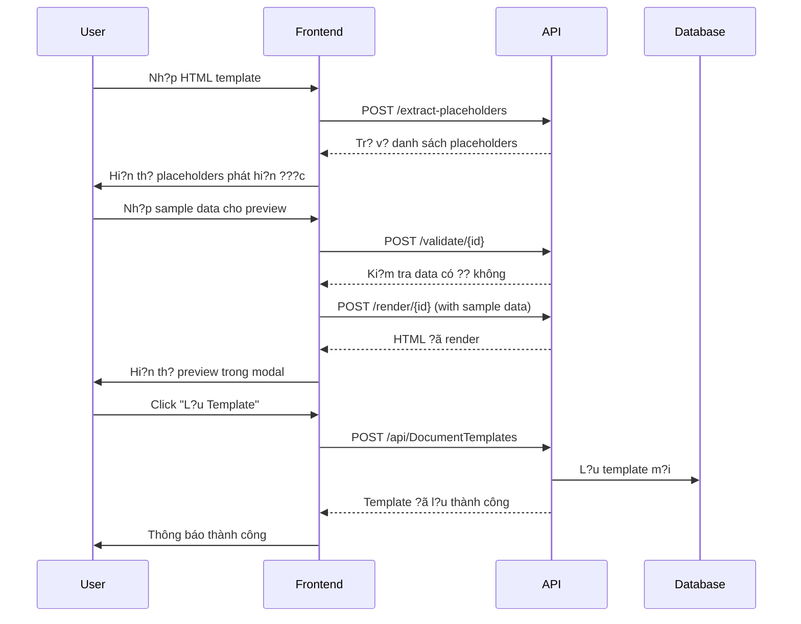

# ?? Template Editor API - Tích H?p Frontend

## ?? T?ng Quan

API m?i ???c thêm vào `DocumentTemplatesController` ?? h? tr? h? th?ng **Template Editor** t? ??ng trên frontend (React/Next.js).

**Các tính n?ng chính:**
- ? T? ??ng phát hi?n placeholders t? HTML
- ? Validate d? li?u tr??c khi render
- ? Render template v?i data ??ng
- ? L?y template kèm thông tin placeholders

---

## ?? API Endpoints M?i

### 1. Extract Placeholders (T? ??ng phát hi?n)

**POST** `/api/DocumentTemplates/extract-placeholders`

T? ??ng phát hi?n t?t c? placeholders trong HTML content theo format `{{VariableName}}`.

#### Request Body

```json
{
  "htmlContent": "<html><body><h1>{{EmployeeName}}</h1><p>L??ng: {{BaseSalary}}</p></body></html>"
}
```

#### Response Success (200 OK)

```json
{
  "success": true,
  "placeholders": [
    "BaseSalary",
    "EmployeeName"
  ],
  "count": 2
}
```

#### Response Error (400)

```json
{
  "message": "htmlContent không ???c ?? tr?ng"
}
```

#### Curl Example

```bash
curl -X POST "https://api.example.com/api/DocumentTemplates/extract-placeholders" \
  -H "Authorization: Bearer {token}" \
  -H "Content-Type: application/json" \
  -d '{
    "htmlContent": "<html>{{CustomerName}} - {{TotalAmount}}</html>"
  }'
```

---

### 2. Get Template With Placeholders

**GET** `/api/DocumentTemplates/with-placeholders/{id}`

L?y template theo ID kèm theo danh sách placeholders ?ã ???c t? ??ng phát hi?n.

#### Path Parameters

| Parameter | Type | Required | Description |
|-----------|------|----------|-------------|
| `id` | `int` | ? | ID c?a template |

#### Response Success (200 OK)

```json
{
  "success": true,
  "data": {
    "template": {
      "id": 5,
      "name": "Salary Notification Template",
      "templateType": "salary_notification",
      "code": "SALARY_NOTIFY_V2",
      "htmlContent": "<html>{{EmployeeName}}...</html>",
      "version": 1,
      "isActive": true,
      "isDefault": false
    },
    "detectedPlaceholders": [
      "BaseSalary",
      "CompanyName",
      "CurrentDate",
      "Department",
      "EmployeeName",
      "Month",
      "NetSalary"
    ],
    "placeholderCount": 7
  }
}
```

#### Curl Example

```bash
curl -X GET "https://api.example.com/api/DocumentTemplates/with-placeholders/5" \
  -H "Authorization: Bearer {token}"
```

---

### 3. Validate Template Data

**POST** `/api/DocumentTemplates/validate/{id}`

Validate xem d? li?u có ?? ?? render template hay không (ki?m tra missing placeholders).

#### Path Parameters

| Parameter | Type | Required | Description |
|-----------|------|----------|-------------|
| `id` | `int` | ? | ID c?a template c?n validate |

#### Request Body

```json
{
  "EmployeeName": "Nguy?n V?n A",
  "BaseSalary": "15,000,000",
  "Department": "IT Department"
}
```

#### Response Success - Valid Data (200 OK)

```json
{
  "success": true,
  "message": "D? li?u h?p l?",
  "isValid": true,
  "providedFields": [
    "EmployeeName",
    "BaseSalary",
    "Department"
  ]
}
```

#### Response Error - Invalid Data (400 Bad Request)

```json
{
  "success": false,
  "message": "D? li?u không h?p l?",
  "isValid": false,
  "missingPlaceholders": [
    "NetSalary",
    "Month",
    "CurrentDate"
  ]
}
```

#### Curl Example

```bash
curl -X POST "https://api.example.com/api/DocumentTemplates/validate/5" \
  -H "Authorization: Bearer {token}" \
  -H "Content-Type: application/json" \
  -d '{
    "EmployeeName": "Nguy?n V?n A",
    "BaseSalary": "15,000,000"
  }'
```

---

### 4. Render Template By ID

**POST** `/api/DocumentTemplates/render/{id}`

Render template theo ID v?i d? li?u ??ng. Tr? v? HTML ?ã ???c replace placeholders.

#### Path Parameters

| Parameter | Type | Required | Description |
|-----------|------|----------|-------------|
| `id` | `int` | ? | ID c?a template c?n render |

#### Request Body

```json
{
  "EmployeeName": "Nguy?n V?n A",
  "BaseSalary": "15,000,000",
  "NetSalary": "13,500,000",
  "Month": "01/2026",
  "Department": "IT Department",
  "CurrentDate": "31/12/2024",
  "CompanyName": "Công ty ABC"
}
```

#### Response Success (200 OK)

**Content-Type:** `text/html; charset=utf-8`

```html
<html>
  <head>
    <title>Thông Báo L??ng</title>
  </head>
  <body>
    <h1>Thông Báo L??ng Tháng 01/2026</h1>
    <p>Kính g?i: <strong>Nguy?n V?n A</strong></p>
    <p>Phòng ban: IT Department</p>
    <p>L??ng c? b?n: 15,000,000 VN?</p>
    <p>L??ng th?c nh?n: 13,500,000 VN?</p>
    <p>Ngày: 31/12/2024</p>
    <footer>Công ty ABC</footer>
  </body>
</html>
```

#### Response Error (404)

```json
{
  "message": "Không tìm th?y template"
}
```

#### Curl Example

```bash
curl -X POST "https://api.example.com/api/DocumentTemplates/render/5" \
  -H "Authorization: Bearer {token}" \
  -H "Content-Type: application/json" \
  -d '{
    "EmployeeName": "Nguy?n V?n A",
    "BaseSalary": "15,000,000",
    "NetSalary": "13,500,000",
    "Month": "01/2026"
  }' \
  --output rendered_template.html
```

---

### 5. Render Template By Code

**POST** `/api/DocumentTemplates/render-by-code/{code}`

Render template theo code (thay vì ID). Ti?n l?i h?n khi bi?t tr??c template code.

#### Path Parameters

| Parameter | Type | Required | Description |
|-----------|------|----------|-------------|
| `code` | `string` | ? | Code c?a template (VD: `SALARY_NOTIFY_V2`) |

#### Request Body

```json
{
  "EmployeeName": "Tr?n Th? B",
  "BaseSalary": "20,000,000",
  "NetSalary": "18,000,000",
  "Month": "02/2026",
  "Department": "HR Department",
  "CurrentDate": "01/01/2025",
  "CompanyName": "Công ty XYZ"
}
```

#### Response Success (200 OK)

**Content-Type:** `text/html; charset=utf-8`

```html
<html>
  <head>
    <title>Thông Báo L??ng</title>
  </head>
  <body>
    <h1>Thông Báo L??ng Tháng 02/2026</h1>
    <p>Kính g?i: <strong>Tr?n Th? B</strong></p>
    <p>Phòng ban: HR Department</p>
    <p>L??ng c? b?n: 20,000,000 VN?</p>
    <p>L??ng th?c nh?n: 18,000,000 VN?</p>
  </body>
</html>
```

#### Response Error (404)

```json
{
  "message": "Template v?i code 'INVALID_CODE' không t?n t?i"
}
```

#### Curl Example

```bash
curl -X POST "https://api.example.com/api/DocumentTemplates/render-by-code/SALARY_NOTIFY_V2" \
  -H "Authorization: Bearer {token}" \
  -H "Content-Type: application/json" \
  -d '{
    "EmployeeName": "Tr?n Th? B",
    "BaseSalary": "20,000,000"
  }'
```

---

## ?? Workflow Tích H?p Frontend

### Quy trình t?o template trong React/Next.js



---

## ?? TypeScript Service Integration

### Complete Template Service

```typescript
import axios from 'axios';

const API_URL = process.env.NEXT_PUBLIC_API_URL || 'http://localhost:5000';

export interface DocumentTemplate {
  id: number;
  name: string;
  templateType: string;
  code: string;
  htmlContent: string;
  description?: string;
  availablePlaceholders?: string;
  version: number;
  isActive: boolean;
  isDefault: boolean;
  createdAt: string;
}

export interface TemplateWithPlaceholders {
  template: DocumentTemplate;
  detectedPlaceholders: string[];
  placeholderCount: number;
}

class TemplateService {
  private getAuthHeaders() {
    const token = localStorage.getItem('token');
    return {
      'Authorization': `Bearer ${token}`,
      'Content-Type': 'application/json'
    };
  }

  // ? T? ??ng phát hi?n placeholders
  async extractPlaceholders(htmlContent: string): Promise<string[]> {
    const response = await axios.post(
      `${API_URL}/api/DocumentTemplates/extract-placeholders`,
      { htmlContent },
      { headers: this.getAuthHeaders() }
    );
    return response.data.placeholders;
  }

  // ? L?y template kèm placeholders
  async getTemplateWithPlaceholders(id: number): Promise<TemplateWithPlaceholders> {
    const response = await axios.get(
      `${API_URL}/api/DocumentTemplates/with-placeholders/${id}`,
      { headers: this.getAuthHeaders() }
    );
    return response.data.data;
  }

  // ? Validate data tr??c khi render
  async validateTemplateData(
    id: number,
    data: Record<string, string>
  ): Promise<{
    isValid: boolean;
    missingPlaceholders?: string[];
  }> {
    try {
      const response = await axios.post(
        `${API_URL}/api/DocumentTemplates/validate/${id}`,
        data,
        { headers: this.getAuthHeaders() }
      );
      return { isValid: true };
    } catch (error: any) {
      if (error.response?.status === 400) {
        return {
          isValid: false,
          missingPlaceholders: error.response.data.missingPlaceholders
        };
      }
      throw error;
    }
  }

  // ? Render template theo ID
  async renderTemplate(
    id: number,
    data: Record<string, string>
  ): Promise<string> {
    const response = await axios.post(
      `${API_URL}/api/DocumentTemplates/render/${id}`,
      data,
      {
        headers: this.getAuthHeaders(),
        responseType: 'text'
      }
    );
    return response.data;
  }

  // ? Render template theo code
  async renderTemplateByCode(
    code: string,
    data: Record<string, string>
  ): Promise<string> {
    const response = await axios.post(
      `${API_URL}/api/DocumentTemplates/render-by-code/${code}`,
      data,
      {
        headers: this.getAuthHeaders(),
        responseType: 'text'
      }
    );
    return response.data;
  }

  // Các method c? v?n gi? nguyên
  async createTemplate(template: any) { /* ... */ }
  async getTemplates(type?: string) { /* ... */ }
  async updateTemplate(id: number, template: any) { /* ... */ }
  async deleteTemplate(id: number) { /* ... */ }
}

export const templateService = new TemplateService();
```

---

## ?? React Component Example

### Template Preview Component

```typescript
import React, { useState } from 'react';
import { templateService } from './templateService';

interface Props {
  templateId: number;
  sampleData: Record<string, string>;
}

const TemplatePreview: React.FC<Props> = ({ templateId, sampleData }) => {
  const [previewHtml, setPreviewHtml] = useState('');
  const [isLoading, setIsLoading] = useState(false);
  const [error, setError] = useState<string | null>(null);

  const handlePreview = async () => {
    setIsLoading(true);
    setError(null);

    try {
      // 1. Validate tr??c
      const validation = await templateService.validateTemplateData(
        templateId,
        sampleData
      );

      if (!validation.isValid) {
        alert(
          `Missing data: ${validation.missingPlaceholders?.join(', ')}`
        );
        return;
      }

      // 2. Render
      const html = await templateService.renderTemplate(
        templateId,
        sampleData
      );

      setPreviewHtml(html);
    } catch (err: any) {
      setError(err.message || 'L?i khi preview template');
      console.error('Preview error:', err);
    } finally {
      setIsLoading(false);
    }
  };

  return (
    <div>
      <button
        onClick={handlePreview}
        disabled={isLoading}
        className="px-4 py-2 bg-purple-600 text-white rounded"
      >
        {isLoading ? '? ?ang t?i...' : '??? Preview'}
      </button>

      {error && (
        <div className="text-red-600 mt-2">? {error}</div>
      )}

      {previewHtml && (
        <div className="mt-4 border rounded">
          <iframe
            srcDoc={previewHtml}
            className="w-full h-[600px]"
            title="Template Preview"
          />
        </div>
      )}
    </div>
  );
};

export default TemplatePreview;
```

---

## ?? Security & Best Practices

### 1. Authentication
- ? T?t c? endpoints yêu c?u JWT token
- ? Token ???c validate qua `[Authorize]` attribute

### 2. Validation
- ? Validate HTML content không r?ng
- ? Ki?m tra template t?n t?i tr??c khi render
- ? Validate data ??y ?? tr??c khi render

### 3. Error Handling
- ? Try-catch cho t?t c? operations
- ? Logging chi ti?t v?i ILogger
- ? Tr? v? error message rõ ràng

### 4. Performance
- ? Regex caching cho extract placeholders
- ? Case-insensitive comparison
- ? Lazy loading templates

---

## ?? Testing Examples

### Test Extract Placeholders

```bash
# Request
curl -X POST "http://localhost:5000/api/DocumentTemplates/extract-placeholders" \
  -H "Authorization: Bearer your_token" \
  -H "Content-Type: application/json" \
  -d '{
    "htmlContent": "<html><h1>{{Name}}</h1><p>{{Email}}</p><p>{{Name}}</p></html>"
  }'

# Response
{
  "success": true,
  "placeholders": ["Email", "Name"],
  "count": 2
}
```

### Test Validate

```bash
# Valid data
curl -X POST "http://localhost:5000/api/DocumentTemplates/validate/5" \
  -H "Authorization: Bearer your_token" \
  -H "Content-Type: application/json" \
  -d '{
    "Name": "John",
    "Email": "john@example.com"
  }'

# Invalid data (missing Email)
curl -X POST "http://localhost:5000/api/DocumentTemplates/validate/5" \
  -H "Authorization: Bearer your_token" \
  -H "Content-Type: application/json" \
  -d '{
    "Name": "John"
  }'
```

### Test Render

```bash
curl -X POST "http://localhost:5000/api/DocumentTemplates/render/5" \
  -H "Authorization: Bearer your_token" \
  -H "Content-Type: application/json" \
  -d '{
    "EmployeeName": "Nguy?n V?n A",
    "BaseSalary": "15,000,000"
  }' \
  --output preview.html
```

---

## ?? API Response Formats

### Success Response Structure

```typescript
interface SuccessResponse<T> {
  success: true;
  data: T;
  message?: string;
}
```

### Error Response Structure

```typescript
interface ErrorResponse {
  success: false;
  message: string;
  error?: string;
  missingPlaceholders?: string[];
}
```

---

## ?? Migration Checklist

- [x] ? T?o `ITemplateRenderService` interface
- [x] ? Implement `TemplateRenderService`
- [x] ? Register service trong DI container (`Program.cs`)
- [x] ? T?o `DocumentTemplatesController` v?i t?t c? endpoints
- [x] ? Thêm 5 endpoints m?i cho Template Editor:
  - POST `/extract-placeholders`
  - GET `/with-placeholders/{id}`
  - POST `/validate/{id}`
  - POST `/render/{id}`
  - POST `/render-by-code/{code}`
- [x] ? Thêm logging chi ti?t
- [x] ? Build thành công
- [ ] ?? Test t?ng endpoint v?i Postman/Swagger
- [ ] ?? Tích h?p frontend React component
- [ ] ?? Test end-to-end workflow

---

## ?? Related Documentation

- [DOCUMENT_TEMPLATES_API_DOCUMENTATION.md](./DOCUMENT_TEMPLATES_API_DOCUMENTATION.md) - API documentation cho t?t c? endpoints c?
- [FRONTEND_TEMPLATE_EDITOR_GUIDE.md](./FRONTEND_TEMPLATE_EDITOR_GUIDE.md) - H??ng d?n tích h?p frontend
- [TemplateRenderService.cs](./Services/TemplateRenderService.cs) - Service implementation

---

**Last Updated:** 2024-12-31  
**API Version:** 2.0  
**Status:** ? Ready for Integration

---

## ?? Quick Start

```bash
# 1. Test extract placeholders
curl -X POST "http://localhost:5000/api/DocumentTemplates/extract-placeholders" \
  -H "Authorization: Bearer {token}" \
  -H "Content-Type: application/json" \
  -d '{"htmlContent": "<html>{{Name}}</html>"}'

# 2. Create template
curl -X POST "http://localhost:5000/api/DocumentTemplates" \
  -H "Authorization: Bearer {token}" \
  -H "Content-Type: application/json" \
  -d '{
    "name": "Test Template",
    "templateType": "test",
    "code": "TEST_001",
    "htmlContent": "<html>{{Name}}</html>"
  }'

# 3. Render template (replace {id} with actual ID)
curl -X POST "http://localhost:5000/api/DocumentTemplates/render/{id}" \
  -H "Authorization: Bearer {token}" \
  -H "Content-Type: application/json" \
  -d '{"Name": "John Doe"}'
```

**Bây gi? b?n có th? b?t ??u tích h?p Template Editor vào frontend!** ??
